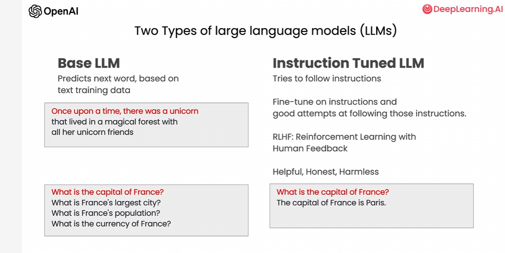
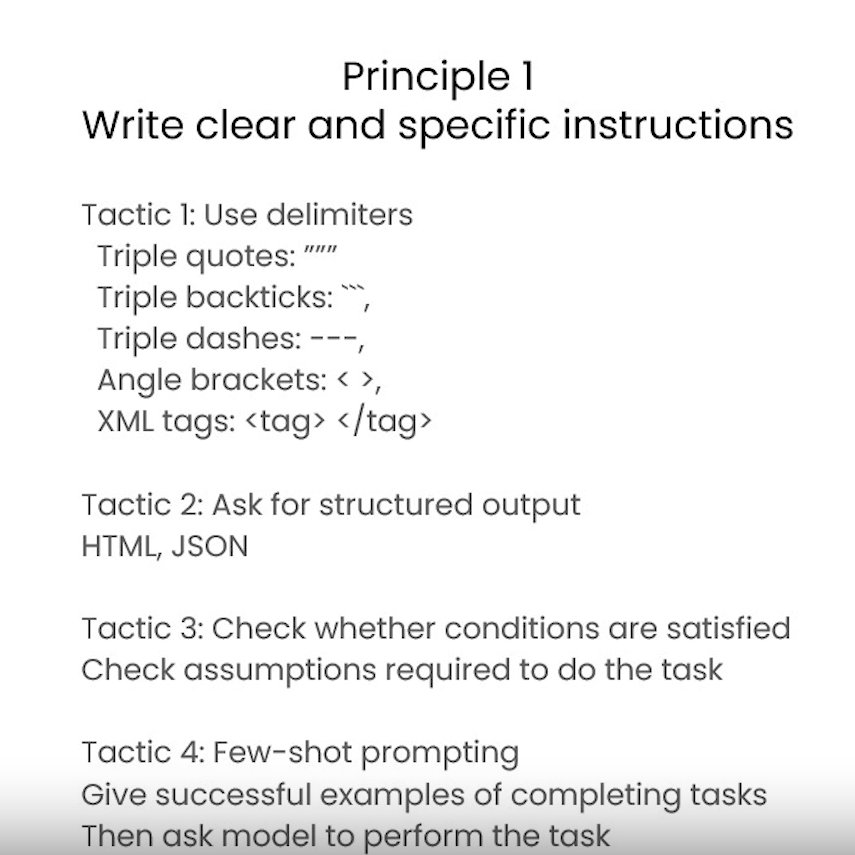
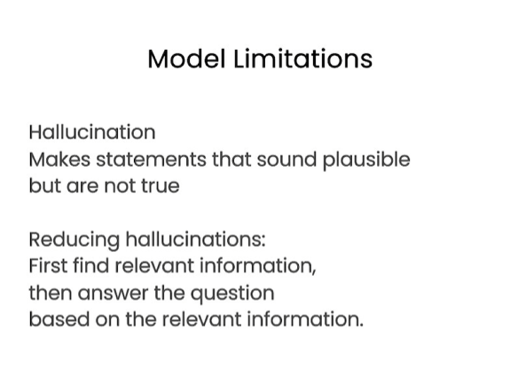
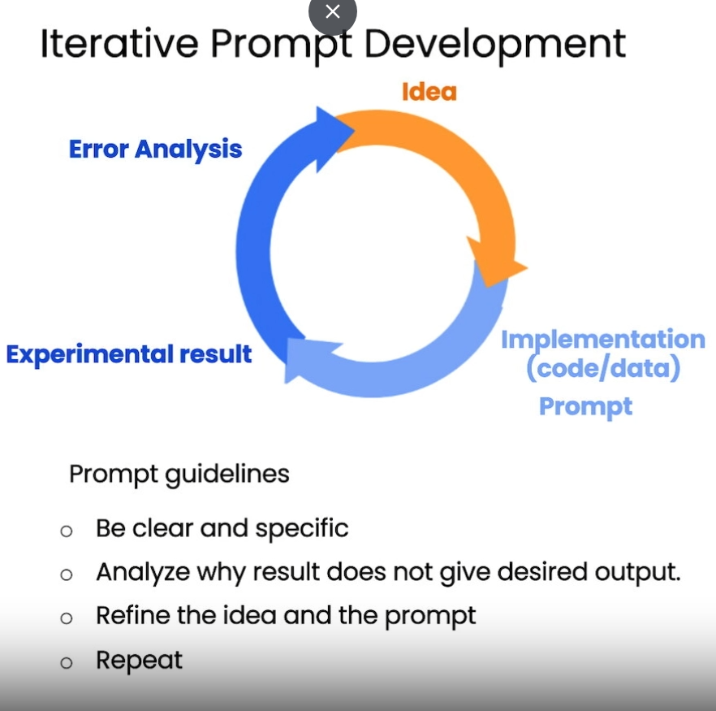
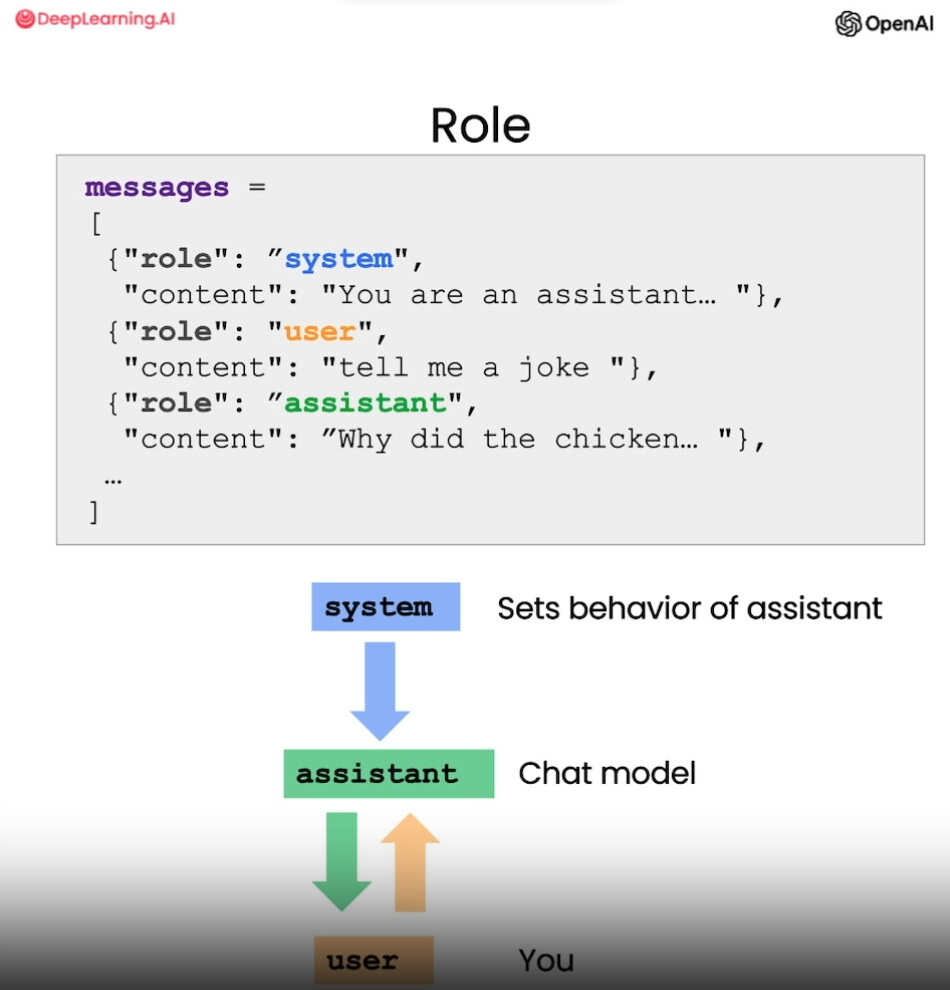
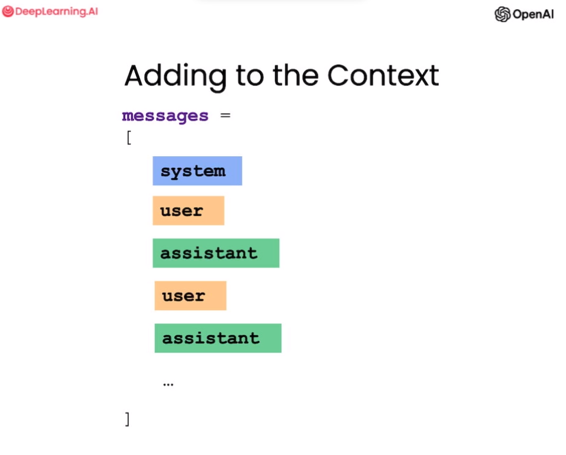

# Prompt Engineering

- prompting: influence the tone of response. 
- `first principle`: give clear and specific instructions, in many cases longer prompt actually provide clear prompts.
- Specify delimeteres like code is in triple backticks ```. We should also ask for a structured output, like JSON, specifies key. Few shot prompting, example of what the output would look like.

-`second principle`: give LLM time to think. specify steps that it could take.





- `Inferring`: extract sentinment from texts, (no need to train different models,), extract words, labels.
- Prompt example: "What is sentinment of the review which is delemited by triple back ticks?", "Identify list of emotions from ....",
- "Identify purchased items, company who made it" .. extracting values. also add "give json with key ..."
- "determine topic being dicussed in the text".
- `Transforming` xml to json, between languages., format .
- `Expanding` ,expanding a topic. automatic reply email "if postivie sentinment give thanks, or tell them to contact customer."
- `Temperature`: degreee of randomness. 0 being least random, and 1 being most random.
- Each convo is new, so it wont remember previous context, so u will have to provide the previous message (context) again in API, to note in chatbox stuff.
 