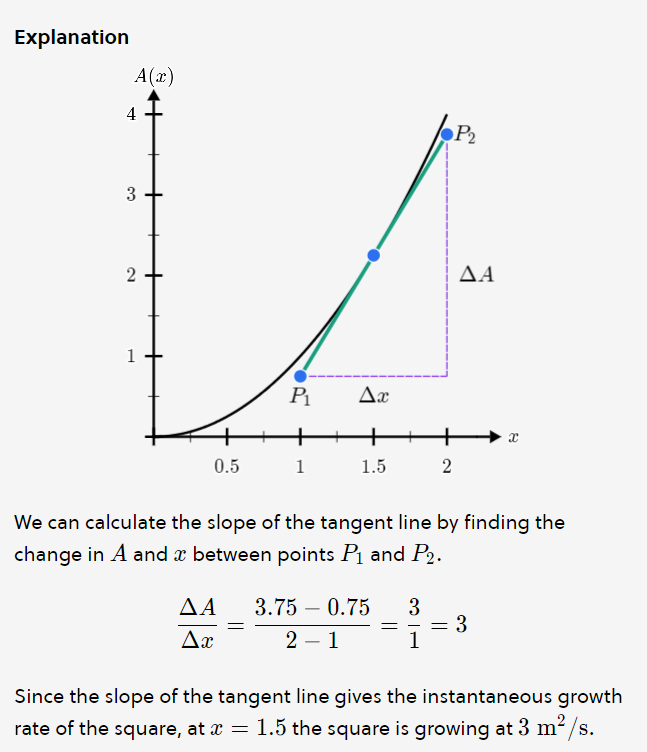

# Calculus
- Calculus describes one of the most fundamental aspects of the physical world: how things change over time.
 - ΔA to refer to the change in area (A2 - A1) and Δx to refer to the change in the side length.
- In the context of a graph, the slope refers to the measure of how steep a line is. It is the ratio of the vertical change (rise) to the horizontal change (run) between two points on the line. Mathematically, the slope (m) is calculated as:
m=change in x/change in y.
- The slope of a secant line is determined by the change in the y-coordinates divided by the change in the x-coordinates between the two points of intersection. Mathematically, the slope (m) of a secant line through two points (x1​,y1​) and (x2​,y2​) on a curve is given by:

m=x2​−x1​y2​−y1

<!--StartFragment-->

**The Slope of a Tangent Line**

As we push one point on a curve infinitely close to another, the slope of the secant line connecting the two points approaches the slope of the tangent line. This, in turn, represents the instantaneous rate of change of f(x) at the second point.

<!--EndFragment-->

- We can calculate the slope of the tangent line by finding the change in A and x between points P1​ and P2​.

ΔxΔA​=2−13.75−0.75​=13​=3

Since the slope of the tangent line gives the instantaneous growth rate of the square, at x=1.5 the square is growing at 3m2/s.

# Derivate

- Right. (Δx)2 gets smaller so much faster than Δx that we can remove it from our calculation entirely, leaving

ΔA=2x⋅Δx

- Δx represents a finite change in the value of x while dx represents an infinitely small change in the value of x.

ΔV=3x2Δx+3x(Δx)2+(Δx)3

Again, since delta X is small, x3 becomes very small fast.

ΔV=3x2Δx
dV/dX=3x(squared)

- Once we found expressions for the derivative of A(x) and V(x), we were able to use them to find the growth rate of a square or a cube for any side length.
<!--StartFragment-->

**Calculus** — developed in the 17th century — is the mathematical study of change.

<!--EndFragment-->
<!--StartFragment-->

Speed is measured as distance/time, so every hour the car covers 30 miles.

In a half-hour, it covers 15 miles.

In one minute, it covers 21​ a mile.

<!--EndFragment-->
<!--StartFragment-->

When speed is changing, the idea of speed at a single moment needs to be defined by what's called a **limiting process**.

When the time interval is reduced to 0 s, the calculation for speed doesn't make any sense because the distance traveled in 0 s is 0 miles.

<!--EndFragment-->
<!--StartFragment-->

In calculus, we say **the limit** as the time interval approaches 0 is the speed s.

The situation where an expression is 00​ is referred to as **indeterminate form**.

<!--EndFragment-->

<!--StartFragment-->

We say as follows:

*   The **limit** of the function f as x approaches a is the number L if, as x gets closer and closer to a, the function values f(x) get closer and closer to L.
*   If there is no such number L, we say the limit **does not exist**.

<!--EndFragment-->
