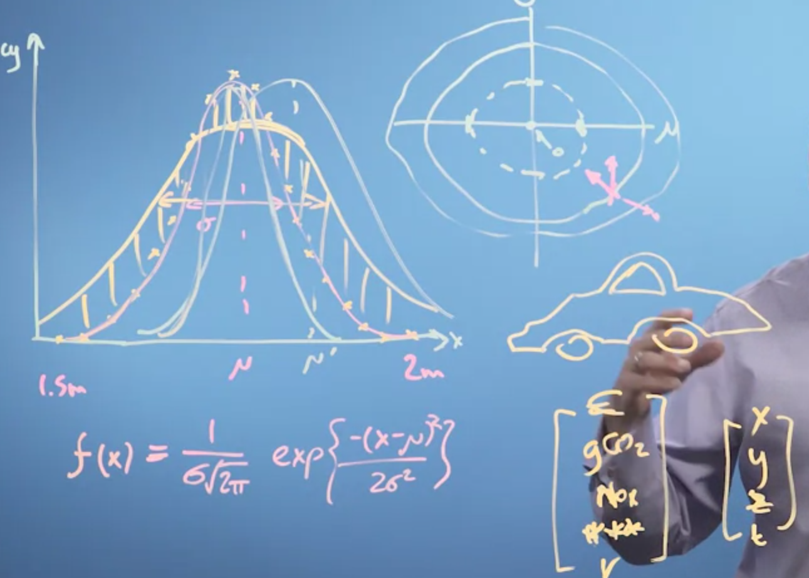

# Linear Algebra
- Problems it solves are situations where there are constants with outputs
- Ex: buying appples, 18A+10=30 … 20A+20=48 … and so on.

# Vectors

- In example graph, plotting high distribution in population.
- Mew **μ** denotes max height, and  sigmar **σ** denotes the width.
- using those two parameters, frequency distribution calculated using the formulate as shown in figure.
- SO when we get different values for those two parameters, we get differnt value.
- **μ** and **σ**  denoted in vector,  [**μ**]
                                                                [**σ** ]
- We change those two values to get best output.
- So here, vectors her contains different parameters in pramter space.
- AS in example, vector can have anything, shows different parameter of a car.
- Addition, add each i and each j, thus its associated, order does not matter.
- Multiplication with scalar, multiply both i and j with the scalar value.
- In the video, bro displays with graph very nicely.