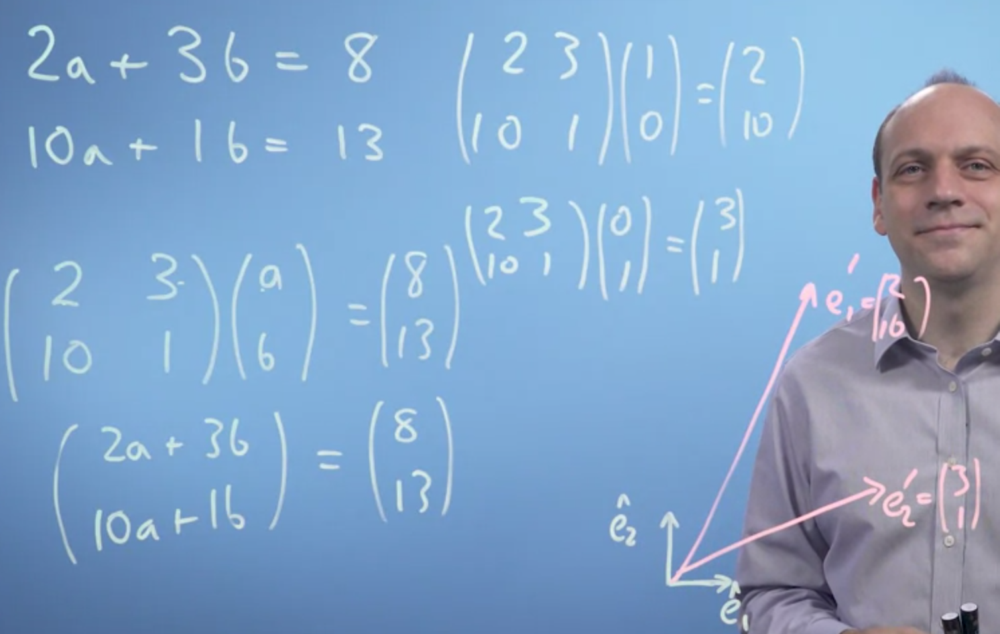
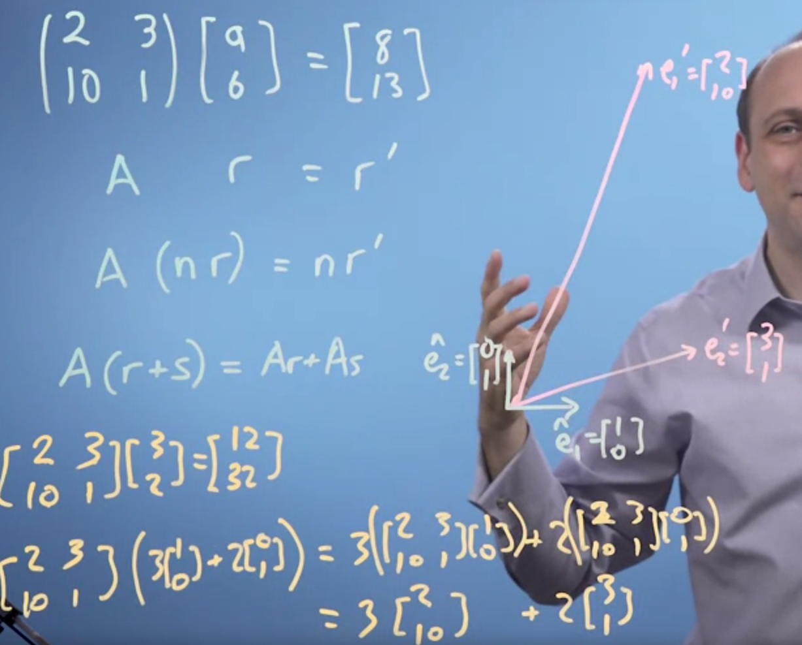
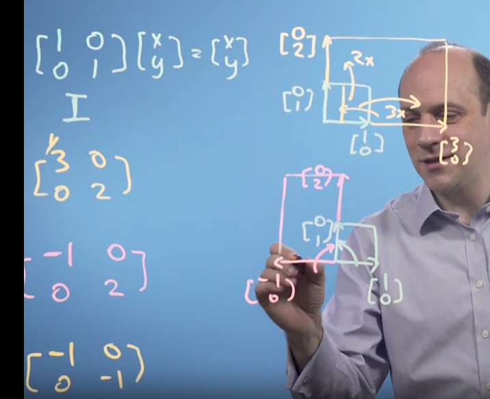
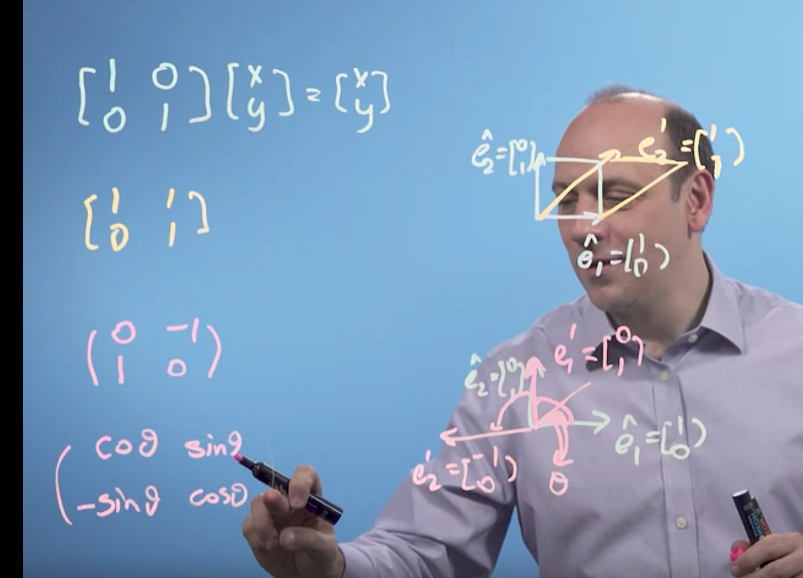

# Matrices

- Simultaneous equation 2a+3b=8 and 10a+1b=13, represented in matrices as in figure above.
- Multiplication works like this row multiplied with columns as shown in figure.
- We can also multiply with unit vertices to get output.
- Now, we change the vertices the matrice is multiplied to, to get the desired outcome.
- From transcript <!--StartFragment-->

 

So linear algebra is a mathematical system for 

manipulating vectors in the spaces described by vectors. 

So this is interesting. 

There seems to be some kind of deep connection between simultaneous equations, 

these things called matrices, and the vectors we were talking about last week. 

And it turns that the key to solving simultaneous equation problems is 

appreciating how vectors are transformed by matrices, 

which is the heart of linear algebra. 

<!--EndFragment-->

- The matrix just tells where the vertices go.

# Types of matrix transformation

- Identity matrix I =
```
I = [1 0][x] = [x]
	[0 1][y]   [y]
Does no change
```
- Replace the 1s with another positive number, and it scales out the vertices
```
I = [3 0][x] = [3x]
	[0 2][y]   [2y]
Does no change
```
- Fraction squishes space
- Negative flips space
- Invert using negative identity
```
I = [-1 0][x]
	[0 -1][y]

```
- Flip space
```
I = [0 1][x]
	[1 0][y]
Flips x and y, like a mirror
```


