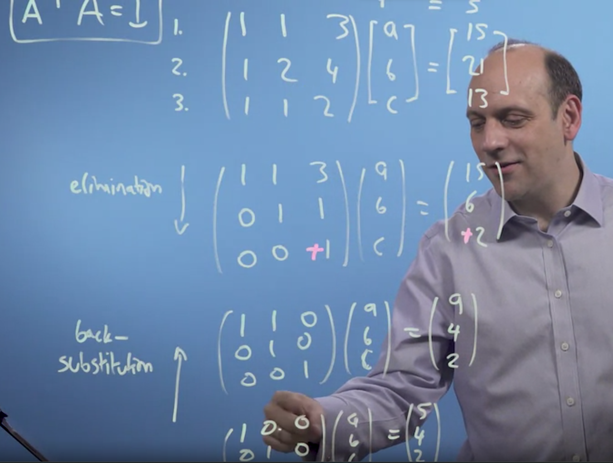
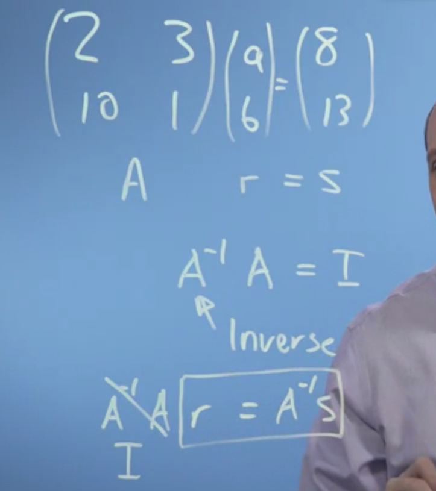
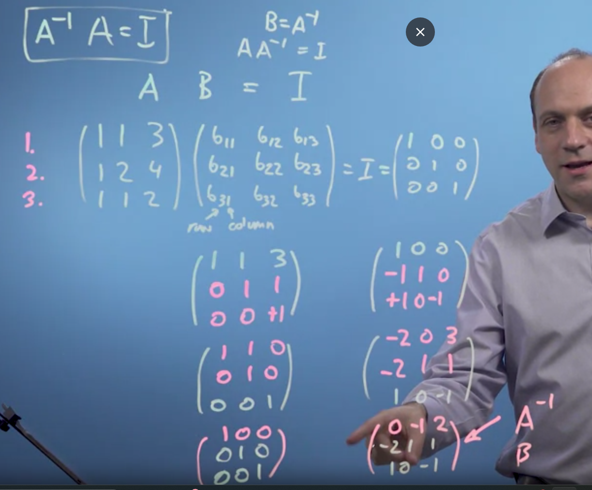
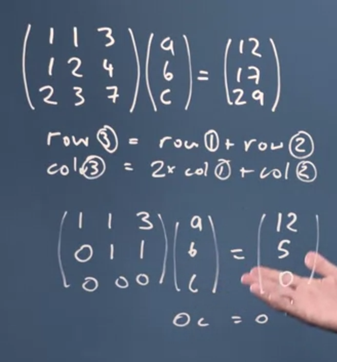
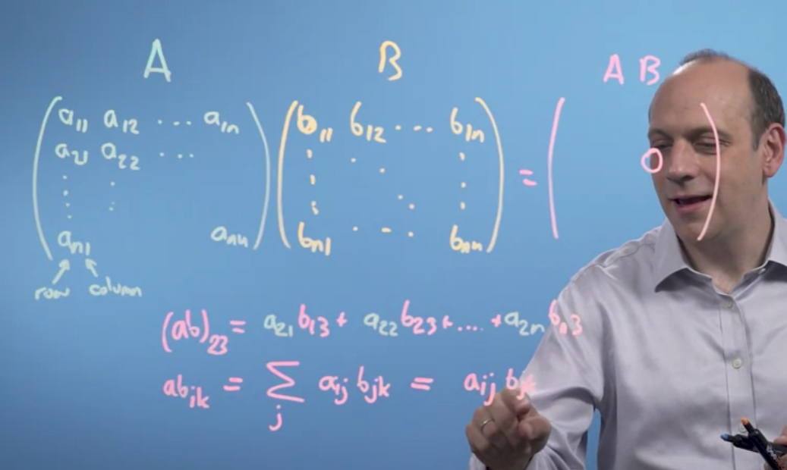
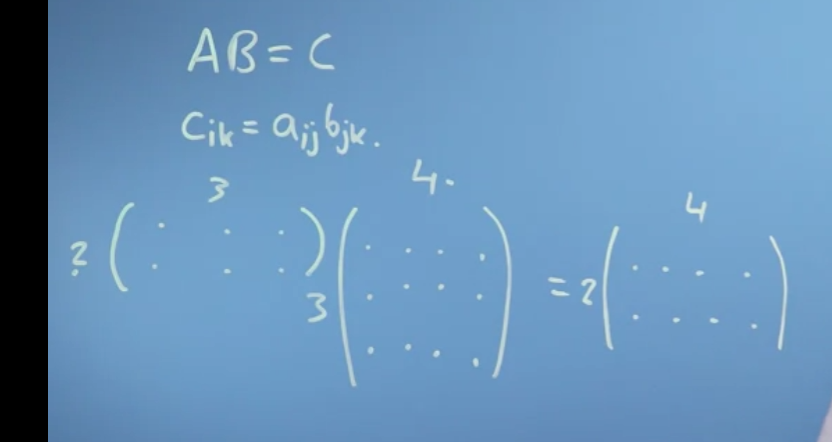
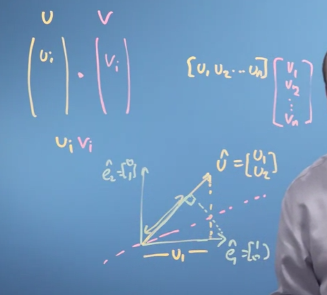
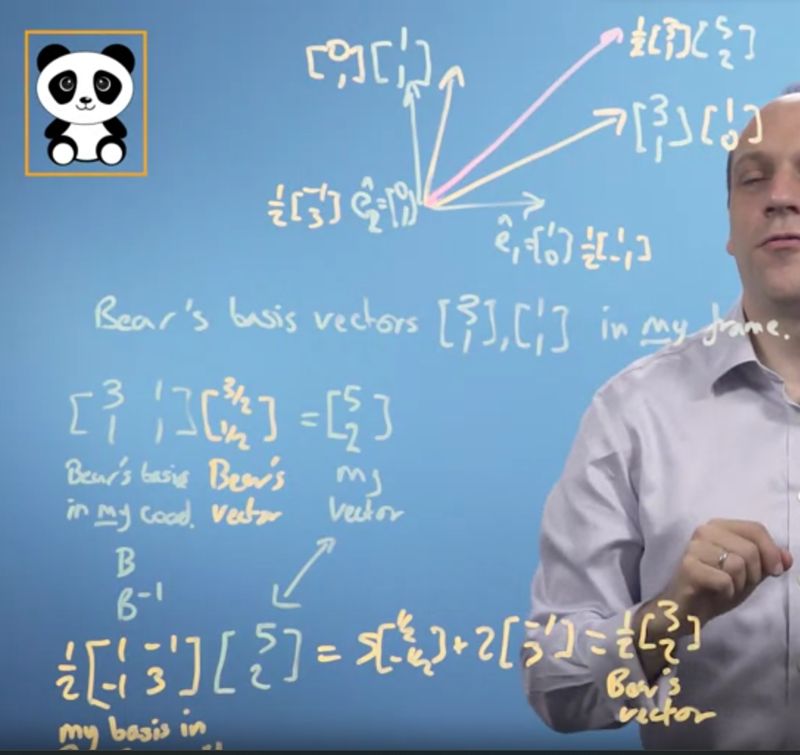
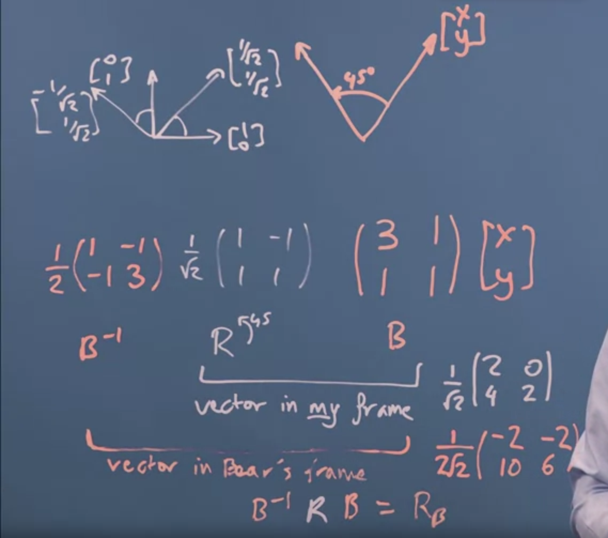

# Matrices

- Simultaneous equation 2a+3b=8 and 10a+1b=13, represented in matrices as in figure above.
- Multiplication works like this row multiplied with columns as shown in figure.
- We can also multiply with unit vertices to get output.
- Now, we change the vertices the matrice is multiplied to, to get the desired outcome.
- From transcript
-  <!--StartFragment-->

So linear algebra is a mathematical system for 

manipulating vectors in the spaces described by vectors. 

So this is interesting. 

There seems to be some kind of deep connection between simultaneous equations, 

these things called matrices, and the vectors we were talking about last week. 

And it turns that the key to solving simultaneous equation problems is 

appreciating how vectors are transformed by matrices, 

which is the heart of linear algebra. 

<!--EndFragment-->

- The matrix just tells where the vertices go.

# Types of matrix transformation

- Identity matrix I =
```
I = [1 0][x] = [x]
	[0 1][y]   [y]
Does no change
```
- Replace the 1s with another positive number, and it scales out the vertices
```
I = [3 0][x] = [3x]
	[0 2][y]   [2y]
Does no change
```
- Fraction squishes space
- Negative flips space
- Invert using negative identity
```
I = [-1 0][x]
	[0 -1][y]

```
- Flip space
```
I = [0 1][x]
	[1 0][y]
Flips x and y, like a mirror
```

### Matrix multiplication
<!--StartFragment-->

Matrix multiplication is a binary operation that takes a pair of matrices, and produces another matrix. The key requirement for matrix multiplication is that the number of columns in the first matrix must be equal to the number of rows in the second matrix. If you have two matrices A and B, and A has dimensions m x n (m rows and n columns), and B has dimensions n x p (n rows and p columns), then their product C (result of multiplication) will have dimensions m x p.

Here's the general formula for matrix multiplication:

Cij​=∑k=1n​(Aik​×Bkj​)

In words, each element Cij​ in the resulting matrix C is obtained by multiplying elements of the corresponding row of matrix A by the corresponding elements of the column of matrix B, and summing up these products.

Let's go through an example. Consider the following matrices:

A=\[1 3
       ​2 4​]
B=\[5 7
        ​6 8​]

To find the product C = A \* B, we calculate each element as follows:

C11​=(1×5)+(2×7)=5+14=19

C12​=(1×6)+(2×8)=6+16=22

C21​=(3×5)+(4×7)=15+28=43

C22​=(3×6)+(4×8)=18+32=50

Therefore, the product C is:

C=\[19 43
        ​22 50​]

Keep in mind that matrix multiplication is not commutative, meaning A×B is not necessarily equal to B×A, and the order matters.

<!--EndFragment-->

Another example 

<!--StartFragment-->

A=\[0 −1
	 ​1 0​]

B=\[1 0
		​1 1​]

The resulting matrix C will be:

C=A×B

Cij​=∑k=12​(Aik​×Bkj​)

Let's calculate each element of C:

C11​=(0×1)+(1×0)=0

C12​=(0×1)+(1×1)=1

C21​=(−1×1)+(0×0)=−1

C22​=(−1×1)+(0×1)=−1

Therefore, the product C is:

C=\[0 −1 ​1−1​]

So, the result of multiplying the given matrices is a 2x2 matrix:

C=\[0−1​1−1​]

<!--EndFragment-->

# Solving the apple and bananas problem

- first take 1 row off of 2 and 3, we got c, and then we did back-substitution.
- In the end, we got the identity matrix.

# Finding inverse matrix using row elemination and back-substitution

- first subsstract first row from 2nd and 3rd on both side,
- then second from 1st and 3rd
- Until we get identity matrix on the left side.
- THe final matrix on the right is our inverse matrix.
- Computationally this is easier, even more easier is decompisition.


If bases are not linearly independent, can solve the equation.

# Einstien Summation convention


- Can multiply as long as J is equal


# changing basis


- to rotate in bears space, inverse of B.