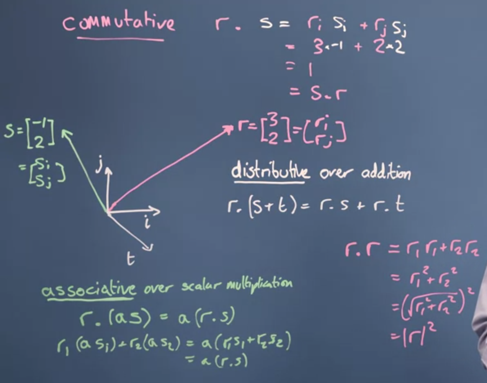
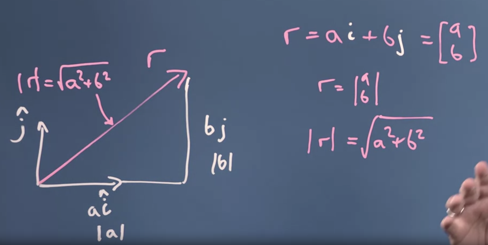
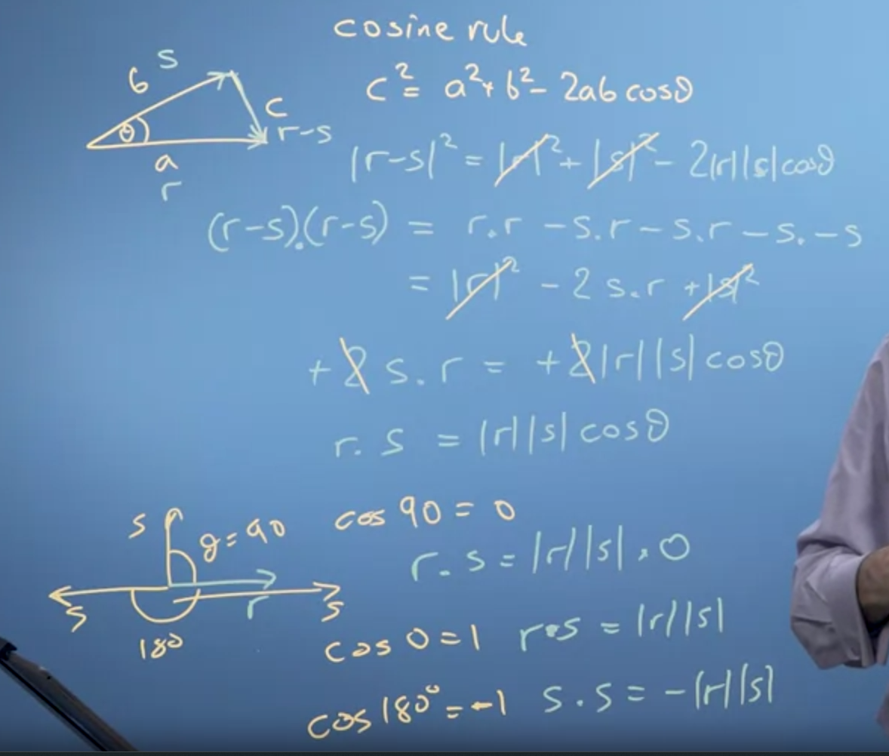
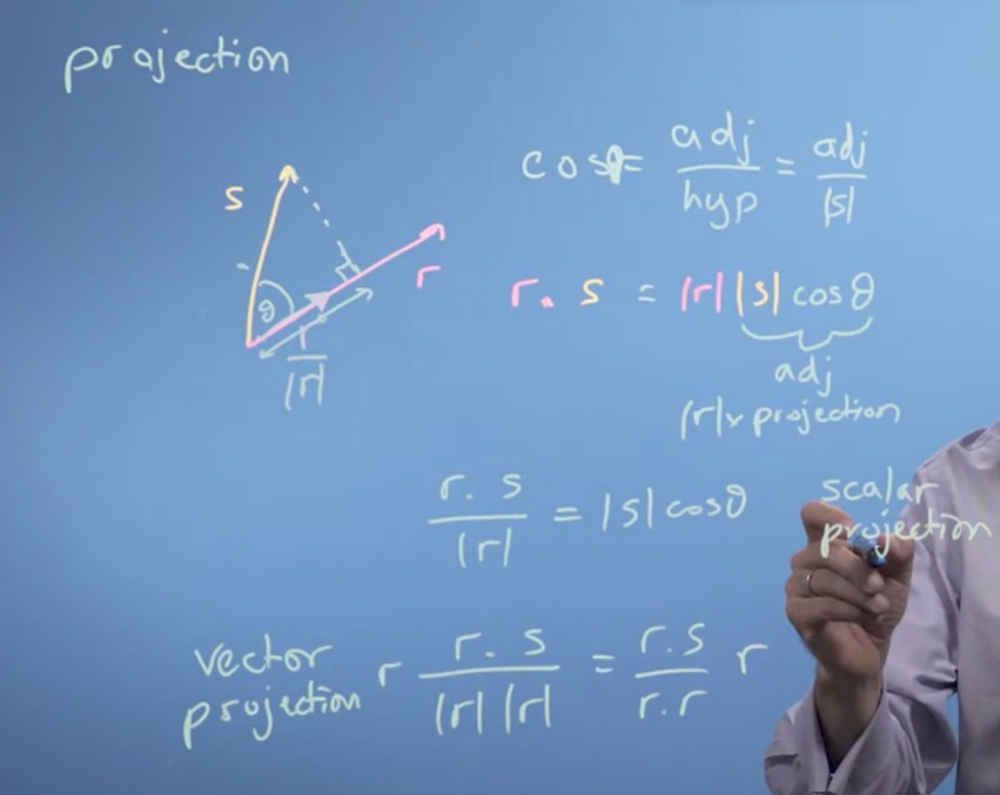
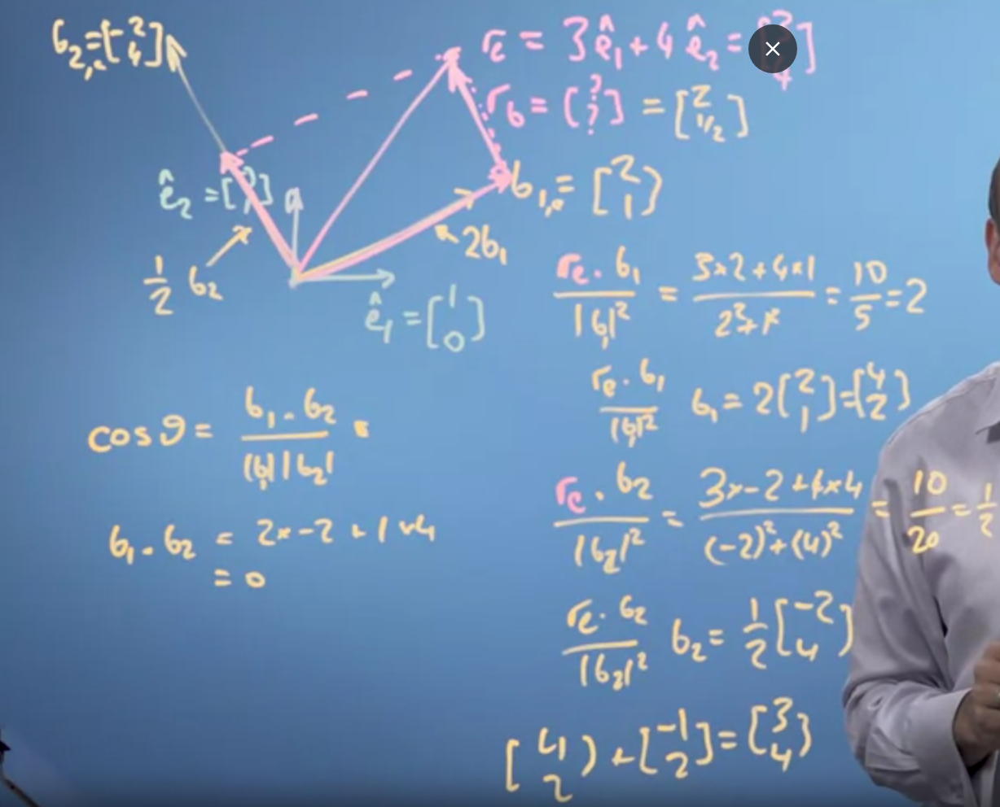
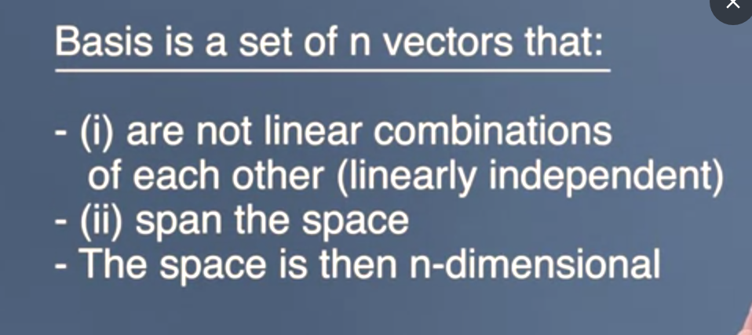
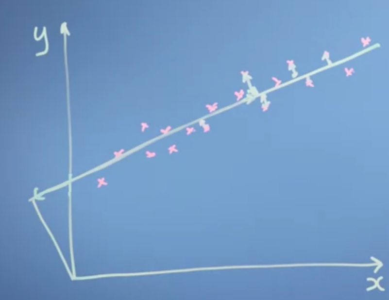

# Dot product

# SIze of vector

# Cosine rule

# Projection
- projection here is shadow of a vector if light was on top of it.s

# Vector basis

- Vector r had no corodinate space.
- We can defined it now on basis of vector e2 and e3. [3 4]
- Two new vector b1 and b2.
- We can find the vector value on the basis of 2 new vectors, given that the 2 new vectors are orthogonal (at right angle) with each other.
- Get scalar projection product onto that vectr, we get the times, now multiply the result with the vector values, we will get the new vector based on te new vectors.
- Now put those values in vector
- Essentially formulate becomes: (re x b1)/|b1| ^ 2
- Do for b2 too
- `[b1_result b2_result]`

- Linearly independednt means, a the basis vector can not be defined with any other vector.
- Basis vector do not need to be orthogonal, but it makes thing easier, like doing dot product same otherwise, we need to use matrices.

### Application of basis vectors

- Consider the graph, with different points.
- We draw a line, this is now our new basis vector, and we redefine the points based on the new line.
- Noise=distance from the line to the points
- Neural network, job is to find the best basis vector that has the least amount of noise.