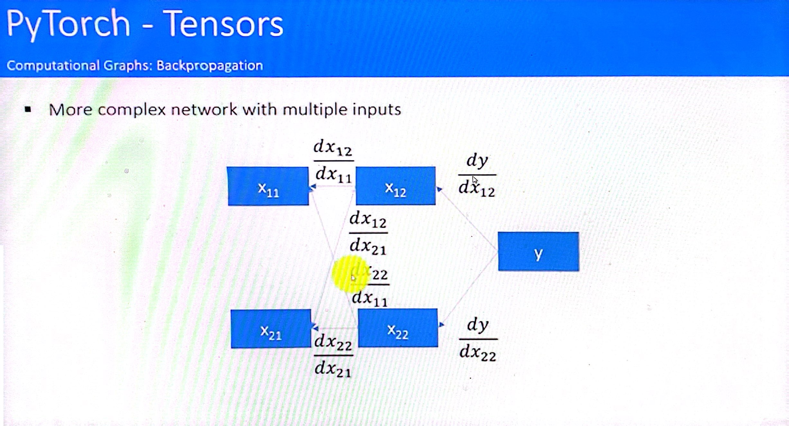

# Tensors
- Structure to work with variables, like numpy arrays.
- Automatically calculates gradients.
- Information about dependence with other tensors.
- Simple network, caclculate output using forward pass, and then calculate derivative using backward pass
- Same but with weights

- More complex process

- Examples

