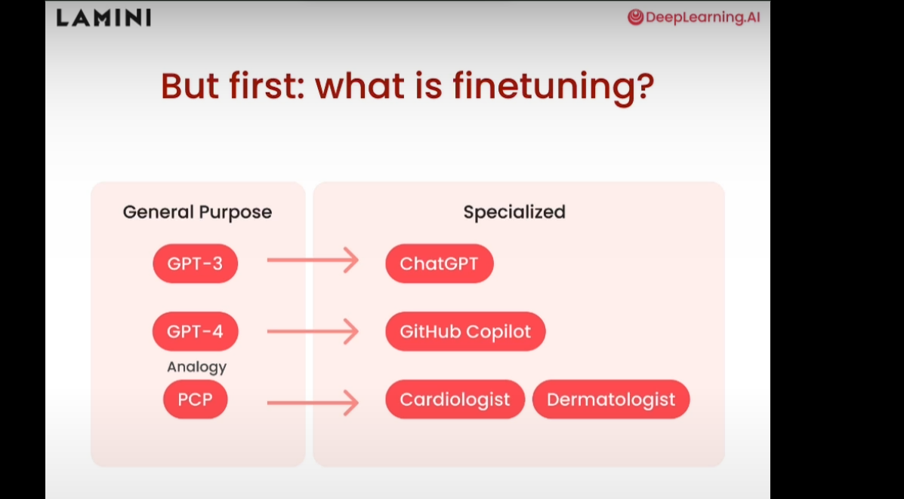
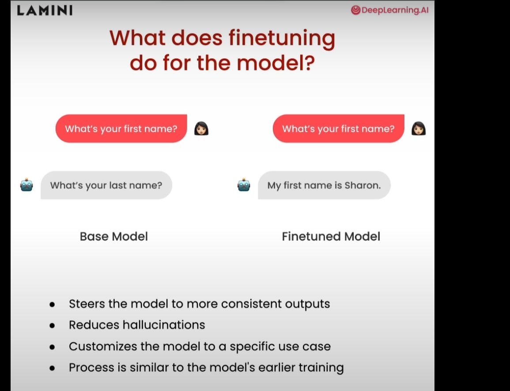
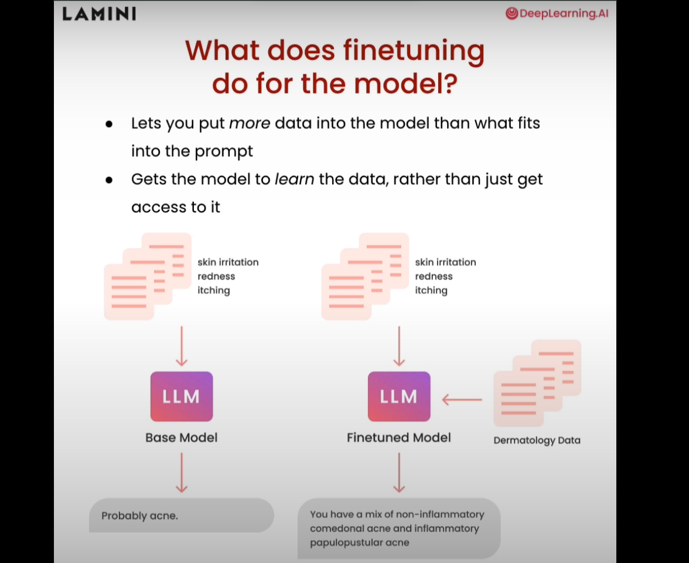
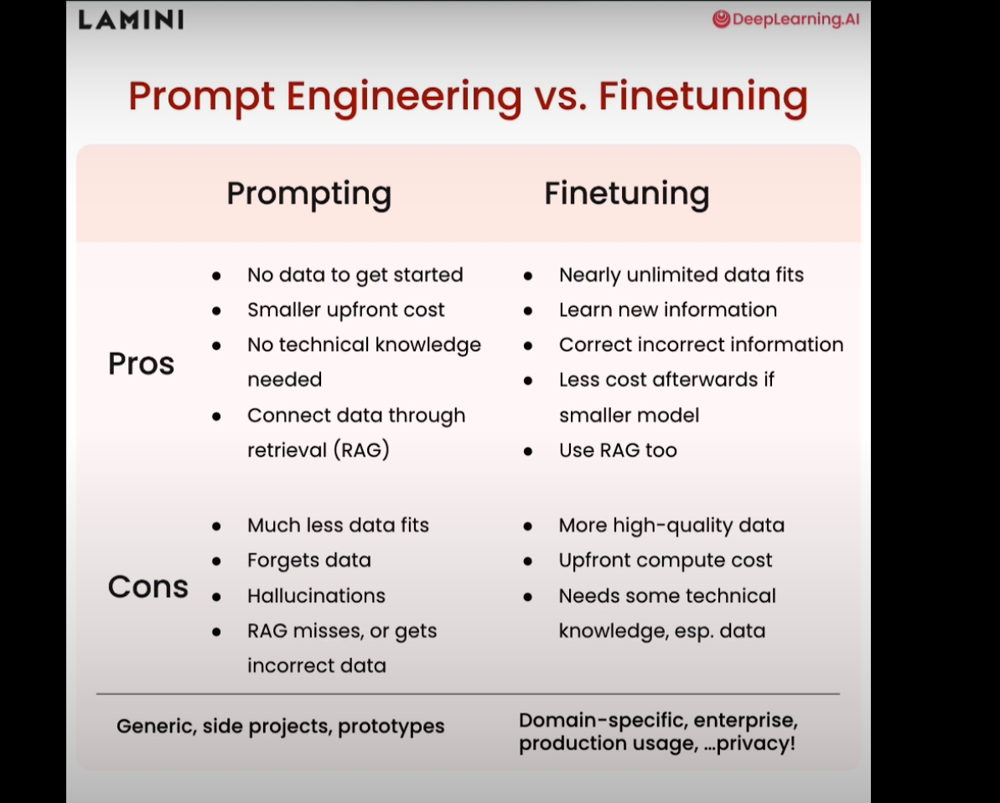
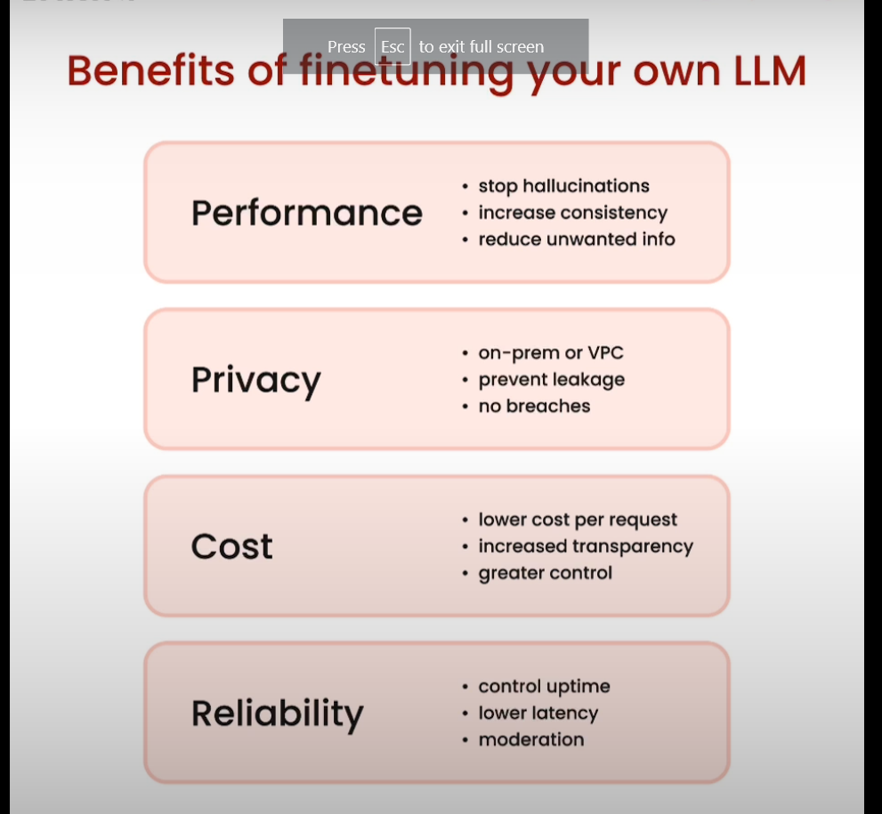

# Fine Tuning Intro
- Reference: [Course By Deep Learning AI](https://learn.deeplearning.ai/courses/finetuning-large-language-models/lesson/1/introduction).
- Train existing LLM with our own data.
- Fine tuning can make the model specialized.

- It helps put more data into the model

# Prompt Engineering vs Fine Tuning

# Benifits

- [fine_tuning_lab](01_Why_finetuning_lab_student.md)
- [pre_training_and_fine_tuning_process](02_The_Process.md)