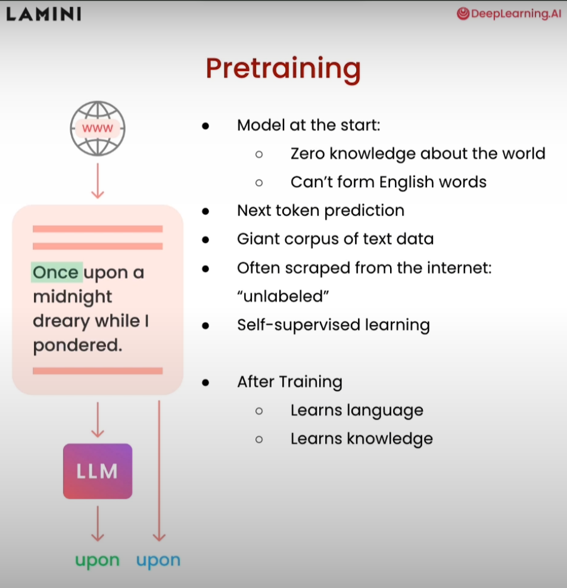
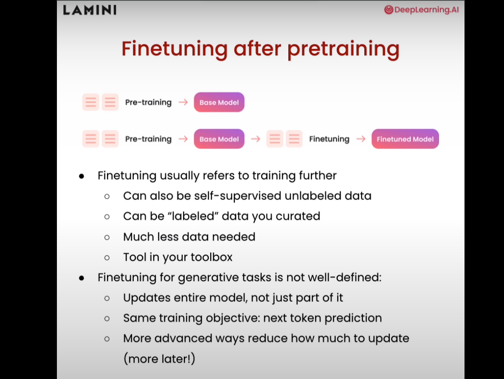
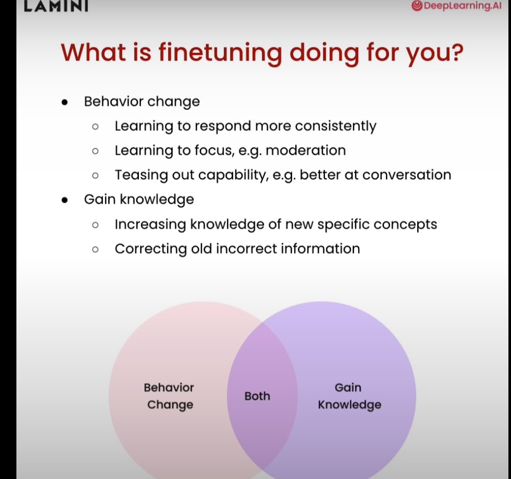
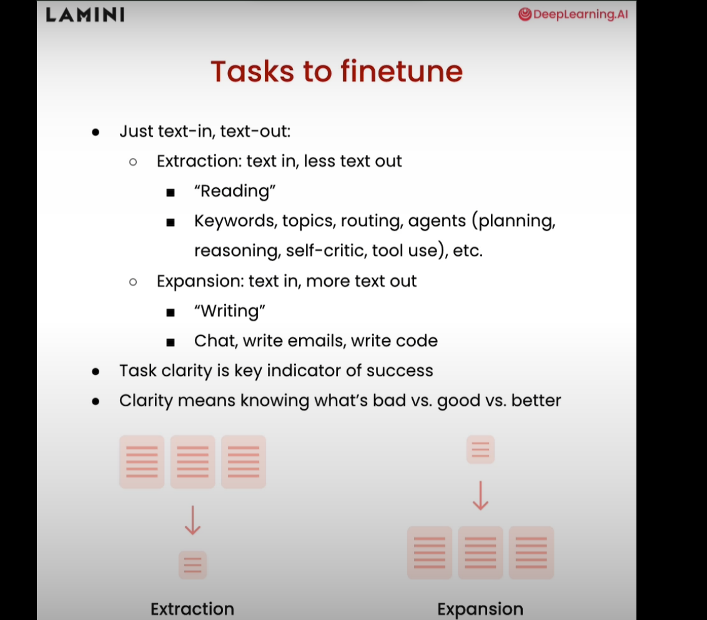
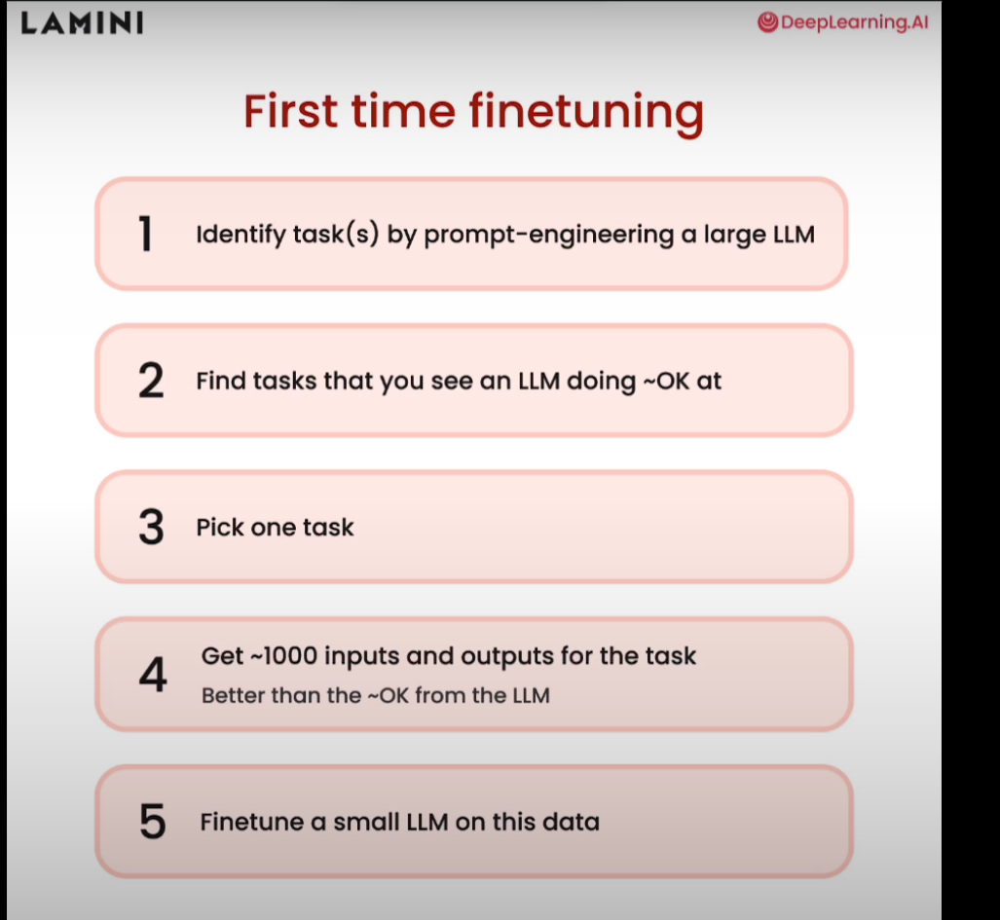

# Pre_Training

- What data from internet is used? Don't know.
- The Pile: Curated list of data.


## Limitations of Pretraiend base models
- Its just a token predcition, not usefule for chat bot.
- U give "what is capital of US?" It may say something like "What is capital of Canada?".
- Not actually answering the question, but instead predicting tokens, almost just spitting out similar texts.

# Fine-Tuning




# Python code
```python
import jsonlines
import itertools
import pandas as pd
from pprint import pprint

import datasets
from datasets import load_dataset

#pretrained_dataset = load_dataset("EleutherAI/pile", split="train", streaming=True)

# streaming=True, streams the data, so that all the data is not downloaded at the same time
pretrained_dataset = load_dataset("c4", "en", split="train", streaming=True)


n = 5
print("Pretrained dataset:")
top_n = itertools.islice(pretrained_dataset, n)
for i in top_n:
  print(i)

# companies data set
filename = "lamini_docs.jsonl"
instruction_dataset_df = pd.read_json(filename, lines=True)
instruction_dataset_df
'''
Sample output
'''

examples = instruction_dataset_df.to_dict()
text = examples["question"][0] + examples["answer"][0]
text
'''
sample output
<!--StartFragment-->

    "What are the different types of documents available in the repository (e.g., installation guide, API documentation, developer's guide)?Lamini has documentation on Getting Started, Authentication, Question Answer Model, Python Library, Batching, Error Handling, Advanced topics, and class documentation on LLM Engine available at https://lamini-ai.github.io/."

<!--EndFragment-->

'''

if "question" in examples and "answer" in examples:
  text = examples["question"][0] + examples["answer"][0]
elif "instruction" in examples and "response" in examples:
  text = examples["instruction"][0] + examples["response"][0]
elif "input" in examples and "output" in examples:
  text = examples["input"][0] + examples["output"][0]
else:
  text = examples["text"][0]

prompt_template_qa = """### Question:
{question}

### Answer:
{answer}"""
question = examples["question"][0]
answer = examples["answer"][0]

text_with_prompt_template = prompt_template_qa.format(question=question, answer=answer)
text_with_prompt_template

# just trying to create data to feed to model
# Now save it
with jsonlines.open(f'lamini_docs_processed.jsonl', 'w') as writer:
    writer.write_all(finetuning_dataset_question_answer)
finetuning_dataset_name = "lamini/lamini_docs"
finetuning_dataset = load_dataset(finetuning_dataset_name)
print(finetuning_dataset)
```