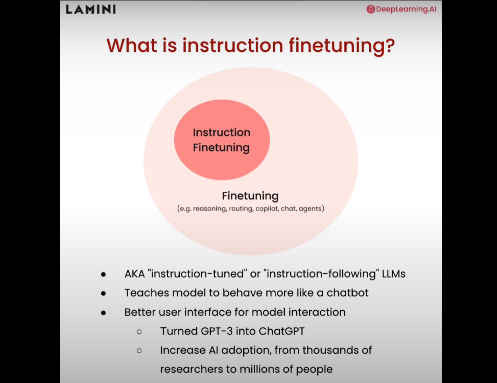

# Instruction-tuning

### Datasets thatcan be used for Instruction-tuning
- FAQs.
- Customer support converstaions.
- slack messags.
- Can use non Q/A sources like README.
- User prompt template.
- User another LLM to generate data.

### Code
```python
import itertools
import jsonlines

from datasets import load_dataset
from pprint import pprint

from llama import BasicModelRunner
from transformers import AutoTokenizer, AutoModelForCausalLM
from transformers import AutoModelForSeq2SeqLM, AutoTokenizer
```

### Load instruction tuned dataset
```python
instruction_tuned_dataset = load_dataset("tatsu-lab/alpaca", split="train", streaming=True)
```
```python
m = 5
print("Instruction-tuned dataset:")
top_m = list(itertools.islice(instruction_tuned_dataset, m))
for j in top_m:
  print(j)
```

### Two prompt templates


```python
prompt_template_with_input = """Below is an instruction that describes a task, paired with an input that provides further context. Write a response that appropriately completes the request.

### Instruction:
{instruction}

### Input:
{input}

### Response:"""

prompt_template_without_input = """Below is an instruction that describes a task. Write a response that appropriately completes the request.

### Instruction:
{instruction}

### Response:"""
```

### Hydrate prompts (add data to prompts)


```python
processed_data = []
for j in top_m:
  if not j["input"]:
    processed_prompt = prompt_template_without_input.format(instruction=j["instruction"])
  else:
    processed_prompt = prompt_template_with_input.format(instruction=j["instruction"], input=j["input"])

  processed_data.append({"input": processed_prompt, "output": j["output"]})

```


```python
pprint(processed_data[0])
```

### Save data to jsonl


```python
with jsonlines.open(f'alpaca_processed.jsonl', 'w') as writer:
    writer.write_all(processed_data)
```

### Compare non-instruction-tuned vs. instruction-tuned models


```python
dataset_path_hf = "lamini/alpaca"
dataset_hf = load_dataset(dataset_path_hf)
print(dataset_hf)
```


```python
non_instruct_model = BasicModelRunner("meta-llama/Llama-2-7b-hf")
non_instruct_output = non_instruct_model("Tell me how to train my dog to sit")
print("Not instruction-tuned output (Llama 2 Base):", non_instruct_output)
```


```python
instruct_model = BasicModelRunner("meta-llama/Llama-2-7b-chat-hf")
instruct_output = instruct_model("Tell me how to train my dog to sit")
print("Instruction-tuned output (Llama 2): ", instruct_output)
```

> Note: This section of the notebook has been updated.

Instruction-tuned output (ChatGPT) responds with:

> Training your dog to sit is a basic and essential command that can be taught using positive reinforcement. Here's a simple step-by-step guide:
> 1. **Prepare Treats:**
   Gather small, soft treats that your dog enjoys. Make sure they are easy to chew and won't take too long to eat.
> 2. **Find a Quiet Space:**
   Choose a quiet area with minimal distractions for the training session. This will help your dog focus better.
> 3. **Get Your Dog's Attention:**
   Call your dog's name to get their attention. Make sure they are looking at you.
> 4. **Use a Treat to Lure:**
   Hold a treat close to your dog's nose, and slowly move your hand upward and slightly backward over their head. As you do this, your dog's natural response will be to follow the treat with their nose, causing them to sit.
> 5. **Say the Command:**
   As your dog starts to sit, say the command "Sit" in a clear and firm voice. Use the word consistently every time you want your dog to sit.
> 6. **Reward and Praise:**
   As soon as your dog sits, immediately reward them with the treat and offer verbal praise. This positive reinforcement will help them associate sitting with positive outcomes.
> 7. **Repeat and Practice:**
   Repeat the process several times in a row during each training session. Keep the sessions short (around 5-10 minutes) to prevent your dog from losing interest.
> 8. **Add Duration:**
   Once your dog consistently sits on command, you can gradually increase the duration by waiting a couple of seconds before giving the treat. This helps reinforce the sit command.
> 9. **Generalize the Command:**
   Practice the "sit" command in different locations and with various distractions to help your dog generalize the behavior.
> 10. **Be Patient and Consistent:**
    Patience and consistency are key in dog training. Always use positive reinforcement, and avoid punishment. If your dog doesn't succeed initially, go back a step and try again.
> 
> Remember that each dog is unique, and some may learn more quickly than others. Adjust your training approach based on your dog's individual needs and progress.

### Try smaller models


```python
tokenizer = AutoTokenizer.from_pretrained("EleutherAI/pythia-70m")
model = AutoModelForCausalLM.from_pretrained("EleutherAI/pythia-70m")
```


```python
def inference(text, model, tokenizer, max_input_tokens=1000, max_output_tokens=100):
  # Tokenize
  input_ids = tokenizer.encode(
          text,
          return_tensors="pt",
          truncation=True,
          max_length=max_input_tokens
  )

  # Generate
  device = model.device
  generated_tokens_with_prompt = model.generate(
    input_ids=input_ids.to(device),
    max_length=max_output_tokens
  )

  # Decode
  generated_text_with_prompt = tokenizer.batch_decode(generated_tokens_with_prompt, skip_special_tokens=True)

  # Strip the prompt
  generated_text_answer = generated_text_with_prompt[0][len(text):]

  return generated_text_answer
```


```python
finetuning_dataset_path = "lamini/lamini_docs"
finetuning_dataset = load_dataset(finetuning_dataset_path)
print(finetuning_dataset)
```


```python
test_sample = finetuning_dataset["test"][0]
print(test_sample)

print(inference(test_sample["question"], model, tokenizer))
```

### Compare to finetuned small model


```python
instruction_model = AutoModelForCausalLM.from_pretrained("lamini/lamini_docs_finetuned")
```


```python
print(inference(test_sample["question"], instruction_model, tokenizer))
```


```python
# Pssst! If you were curious how to upload your own dataset to Huggingface
# Here is how we did it

# !pip install huggingface_hub
# !huggingface-cli login

# import pandas as pd
# import datasets
# from datasets import Dataset

# finetuning_dataset = Dataset.from_pandas(pd.DataFrame(data=finetuning_dataset))
# finetuning_dataset.push_to_hub(dataset_path_hf)
```
