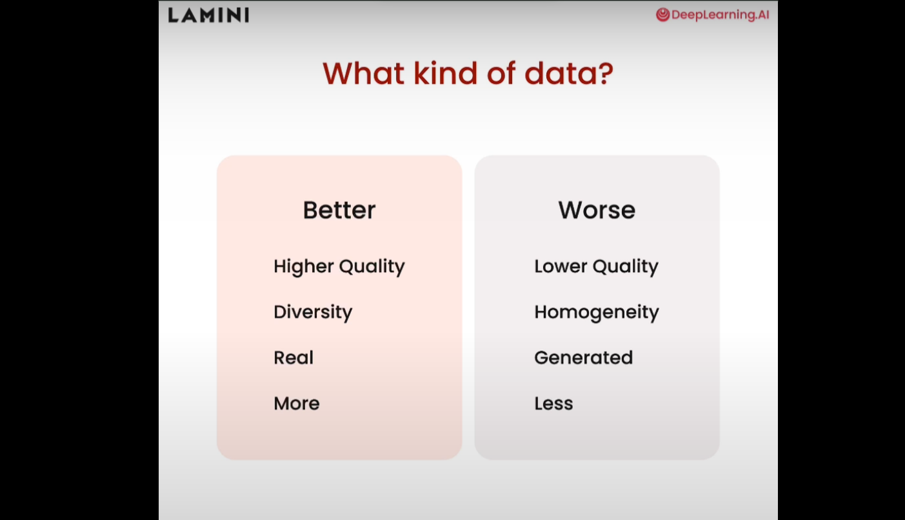
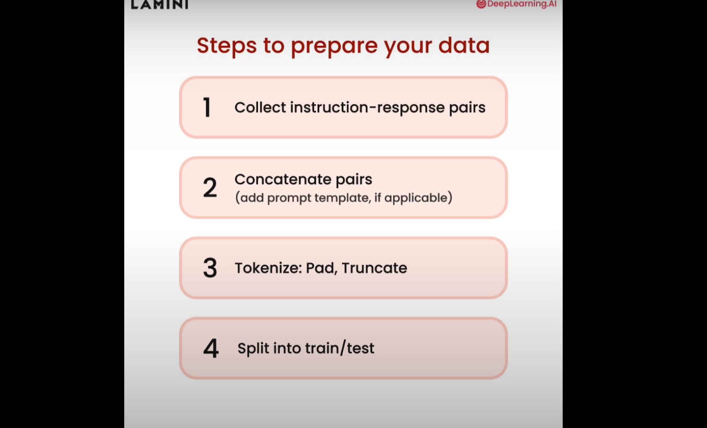
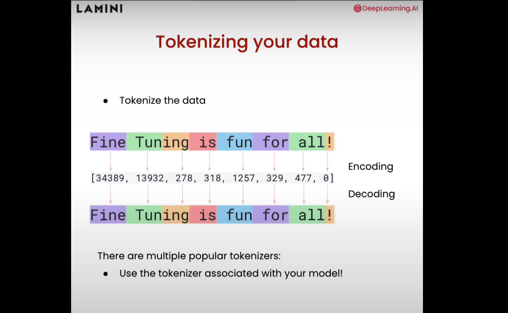

# Data preparation



```python
import pandas as pd
import datasets

from pprint import pprint
from transformers import AutoTokenizer
```

### Tokenizing text
- Turn words into floating numbers.
- Autotokenizer automatically tokenizes based on the model.


```python
tokenizer = AutoTokenizer.from_pretrained("EleutherAI/pythia-70m")
```


```python
text = "Hi, how are you?"
```


```python
encoded_text = tokenizer(text)["input_ids"]
```


```python
encoded_text
```


```python
decoded_text = tokenizer.decode(encoded_text)
print("Decoded tokens back into text: ", decoded_text)
```

### Tokenize multiple texts at once

```python
list_texts = ["Hi, how are you?", "I'm good", "Yes"]
encoded_texts = tokenizer(list_texts)
print("Encoded several texts: ", encoded_texts["input_ids"])
```

### Padding and truncation
- Tensor are fixed size, so padding
```python
tokenizer.pad_token = tokenizer.eos_token 
encoded_texts_longest = tokenizer(list_texts, padding=True)
print("Using padding: ", encoded_texts_longest["input_ids"])
```


```python
encoded_texts_truncation = tokenizer(list_texts, max_length=3, truncation=True)
print("Using truncation: ", encoded_texts_truncation["input_ids"])
```


```python
tokenizer.truncation_side = "left"
encoded_texts_truncation_left = tokenizer(list_texts, max_length=3, truncation=True)
print("Using left-side truncation: ", encoded_texts_truncation_left["input_ids"])
```


```python
encoded_texts_both = tokenizer(list_texts, max_length=3, truncation=True, padding=True)
print("Using both padding and truncation: ", encoded_texts_both["input_ids"])
```

### Prepare instruction dataset


```python
import pandas as pd

filename = "lamini_docs.jsonl"
instruction_dataset_df = pd.read_json(filename, lines=True)
examples = instruction_dataset_df.to_dict()

if "question" in examples and "answer" in examples:
  text = examples["question"][0] + examples["answer"][0]
elif "instruction" in examples and "response" in examples:
  text = examples["instruction"][0] + examples["response"][0]
elif "input" in examples and "output" in examples:
  text = examples["input"][0] + examples["output"][0]
else:
  text = examples["text"][0]

prompt_template = """### Question:
{question}

### Answer:"""

num_examples = len(examples["question"])
finetuning_dataset = []
for i in range(num_examples):
  question = examples["question"][i]
  answer = examples["answer"][i]
  text_with_prompt_template = prompt_template.format(question=question)
  finetuning_dataset.append({"question": text_with_prompt_template, "answer": answer})

from pprint import pprint
print("One datapoint in the finetuning dataset:")
pprint(finetuning_dataset[0])
```

### Tokenize a single example


```python
text = finetuning_dataset[0]["question"] + finetuning_dataset[0]["answer"]
tokenized_inputs = tokenizer(
    text,
    return_tensors="np",
    padding=True
)
print(tokenized_inputs["input_ids"])
```


```python
max_length = 2048
max_length = min(
    tokenized_inputs["input_ids"].shape[1],
    max_length,
)
```


```python
tokenized_inputs = tokenizer(
    text,
    return_tensors="np",
    truncation=True,
    max_length=max_length
)
```


```python
tokenized_inputs["input_ids"]
```

### Tokenize the instruction dataset


```python
def tokenize_function(examples):
    if "question" in examples and "answer" in examples:
      text = examples["question"][0] + examples["answer"][0]
    elif "input" in examples and "output" in examples:
      text = examples["input"][0] + examples["output"][0]
    else:
      text = examples["text"][0]

    tokenizer.pad_token = tokenizer.eos_token
    tokenized_inputs = tokenizer(
        text,
        return_tensors="np",
        padding=True,
    )

    max_length = min(
        tokenized_inputs["input_ids"].shape[1],
        2048
    )
    tokenizer.truncation_side = "left"
    tokenized_inputs = tokenizer(
        text,
        return_tensors="np",
        truncation=True,
        max_length=max_length
    )

    return tokenized_inputs
```


```python
finetuning_dataset_loaded = datasets.load_dataset("json", data_files=filename, split="train")

tokenized_dataset = finetuning_dataset_loaded.map(
    tokenize_function,
    batched=True,
    batch_size=1,
    drop_last_batch=True
)

print(tokenized_dataset)
```


```python
tokenized_dataset = tokenized_dataset.add_column("labels", tokenized_dataset["input_ids"])
```

### Prepare test/train splits


```python
split_dataset = tokenized_dataset.train_test_split(test_size=0.1, shuffle=True, seed=123)
print(split_dataset)
```

### Some datasets for you to try


```python
finetuning_dataset_path = "lamini/lamini_docs"
finetuning_dataset = datasets.load_dataset(finetuning_dataset_path)
print(finetuning_dataset)
```


```python
taylor_swift_dataset = "lamini/taylor_swift"
bts_dataset = "lamini/bts"
open_llms = "lamini/open_llms"
```


```python
dataset_swiftie = datasets.load_dataset(taylor_swift_dataset)
print(dataset_swiftie["train"][1])
```


```python
# This is how to push your own dataset to your Huggingface hub
# !pip install huggingface_hub
# !huggingface-cli login
# split_dataset.push_to_hub(dataset_path_hf)
```
