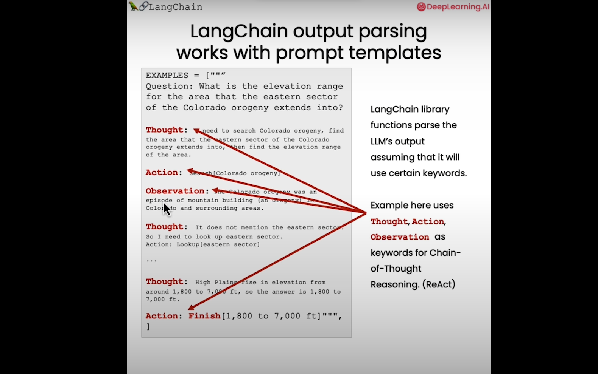

# Intro
- models is the LLM
- Prompts style of creating inputs to pass into the models
- parsers, involves taking output of models and do something with it.
- `temperature` higher means more random.
- Prompts obviously, be more precise.

## Prompt Templates
- Helps making using prompts easier.
```python
from langchain.prompts import ChatPromptTemplate
chat = ChatOpenAI(temperature=0.0, model=llm_model)
chat
template_string = """Translate the text \
that is delimited by triple backticks \
into a style that is {style}. \
text: ```{text}```
"""
prompt_template = ChatPromptTemplate.from_template(template_string)
prompt_template.messages[0].prompt
prompt_template.messages[0].prompt.input_variables
customer_style = """American English \
in a calm and respectful tone
"""
customer_email = """
Arrr, I be fuming that me blender lid \
flew off and splattered me kitchen walls \
with smoothie! And to make matters worse, \
the warranty don't cover the cost of \
cleaning up me kitchen. I need yer help \
right now, matey!
"""

customer_messages = prompt_template.format_messages(
                    style=customer_style,
                    text=customer_email)
print(type(customer_messages))
print(type(customer_messages[0]))

# Call the LLM to translate to the style of the customer message
customer_response = chat(customer_messages)
```

