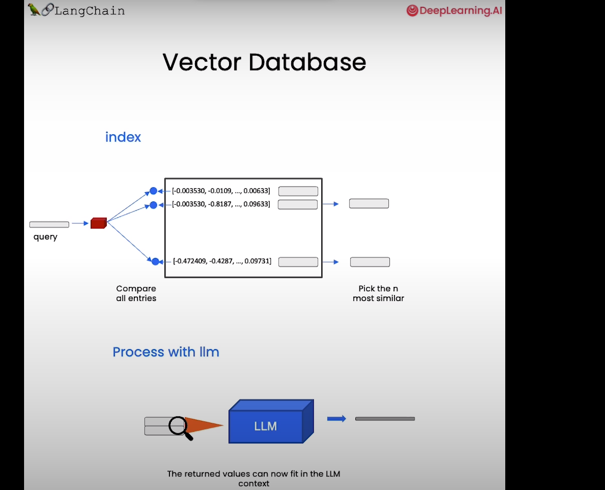

# LangChain: Q&A over Documents

- Query a document using LLM.

```python
from langchain.chains import RetrievalQA  # Does retreival over some document
from langchain.chat_models import ChatOpenAI
from langchain.document_loaders import CSVLoader
from langchain.vectorstores import DocArrayInMemorySearch  # VectoreStore in In memory search
from IPython.display import display, Markdown
from langchain.llms import OpenAI
```


```python
file = 'OutdoorClothingCatalog_1000.csv'
loader = CSVLoader(file_path=file)
```

- Create a vectore store
```python
from langchain.indexes import VectorstoreIndexCreator
```


```python
#pip install docarray
```

- Use the following vector store class, and .from_loaders creates list of document loaders.

- Created vector embeddings are then stored in vector database, and a index is created. During query, the query is embedded too, and the most similar embedding is searced up in DB.

- The returned value can now be passed in language prompt to get our answer

```python
index = VectorstoreIndexCreator(
    vectorstore_cls=DocArrayInMemorySearch
).from_loaders([loader])
```


```python
query ="Please list all your shirts with sun protection \
in a table in markdown and summarize each one."
```

**Note**:
- The notebook uses `langchain==0.0.179` and `openai==0.27.7`
- For these library versions, `VectorstoreIndexCreator` uses `text-davinci-003` as the base model, which has been deprecated since 1 January 2024.
- The replacement model, `gpt-3.5-turbo-instruct` will be used instead for the `query`.
- The `response` format might be different than the video because of this replacement model.


```python
llm_replacement_model = OpenAI(temperature=0, 
                               model='gpt-3.5-turbo-instruct')

response = index.query(query, 
                       llm = llm_replacement_model)
```


```python
display(Markdown(response))
```

## Step By Step
```python
from langchain.document_loaders import CSVLoader
loader = CSVLoader(file_path=file)
```

- This returns all the documents
```python
docs = loader.load()
docs[0]
```

- Creating a embedding, (OpenAIEMbeddings, and adding a embedding)
```python
from langchain.embeddings import OpenAIEmbeddings
embeddings = OpenAIEmbeddings()
embed = embeddings.embed_query("Hi my name is Harrison")
print(len(embed))
```

- Vector representation of that query
```python
print(embed[:5])
```

- Create a Vector DB from documents and with the embeddings we created earlier (OpenAIEmbeddings)
```python
db = DocArrayInMemorySearch.from_documents(
    docs, 
    embeddings
)
query = "Please suggest a shirt with sunblocking"
```

- Find texts that are similar to the query
```python
docs = db.similarity_search(query)
len(docs)
docs[0]
```

- Use the db as a retreive, it returns a common interface that we can send query to and get response
```python
retriever = db.as_retriever()
llm = ChatOpenAI(temperature = 0.0, model=llm_model)
```

- Join all the docs into a single one
```python
qdocs = "".join([docs[i].page_content for i in range(len(docs))])

```

- `Optional`If u want to do it manually in prompt, pass in the docs in prompt itself
```python
response = llm.call_as_llm(f"{qdocs} Question: Please list all your \
shirts with sun protection in a table in markdown and summarize each one.") 
display(Markdown(response))
```

- Create a retreival QA chain where we can query to llm and get response. Pass in the LLM, chain_type="stuff" means just stuff the docs, retreiver is the vector DB retreiver
```python
qa_stuff = RetrievalQA.from_chain_type(
    llm=llm, 
    chain_type="stuff", 
    retriever=retriever, 
    verbose=True
)
query =  "Please list all your shirts with sun protection in a table \
in markdown and summarize each one."
```

- Run the query and get response
```python
response = qa_stuff.run(query)

display(Markdown(response))
```
- The one liner 
```python
index = VectorstoreIndexCreator(
    vectorstore_cls=DocArrayInMemorySearch,
    embedding=embeddings,
).from_loaders([loader])
response = index.query(query, llm=llm)
```
