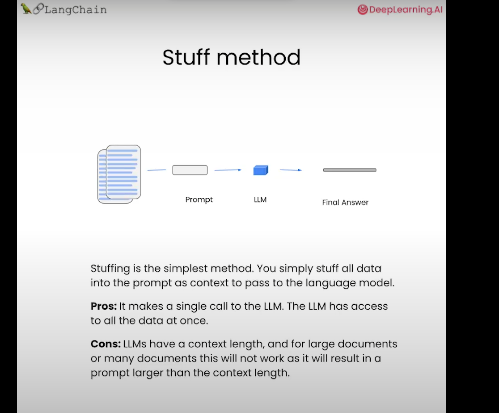
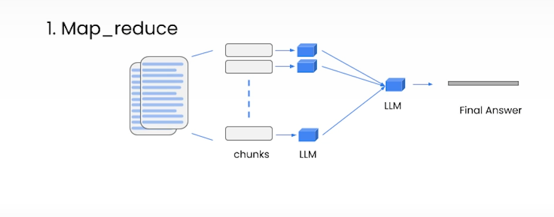
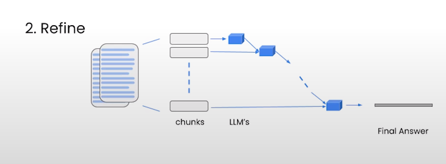
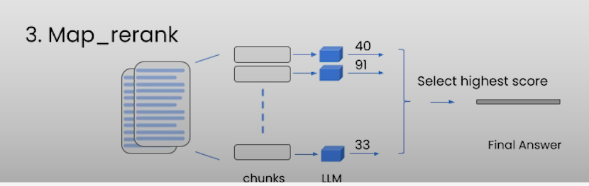

# Retreival over vectore store
- Good resource [Langchain](https://python.langchain.com/docs/modules/data_connection/retrievers/vectorstore)
- here k=1 means number of documents to retreive.
```python
retriever = db.as\_retriever(search\_kwargs={"k": 1})
```
## stuff


- For large documents, many chunks, so stuff method might not be good.
## map_reduce
- `map_reduce`, passes all the chunks with questions to LLM, gets the response, another LLM call to summarize the responses.
- More calls, so a bit slow
- Treats each documents as independent, which might not be the correct choice.
- Basically, it loops through all chunks, gets answers, puts all the answers in the final prompt, and gets answer.
- Good for summarization.


## Refine
- Similar more chunks, but does it iteratively. Uses one chunks gets its answer, then uses that as input for another LLM query.
- Good for combining information, and gives longer anwers.
- Similar amount of calls, but query are not independent. Takes longer than map_reduce.
- It loops through all document chunks, gets answer, and asks LLM to refine the answer in the prompt.
- Better context


## Map_rerank
- Ask LLM to give score for relativity, and select the highest one.
- Relies on LLM.

