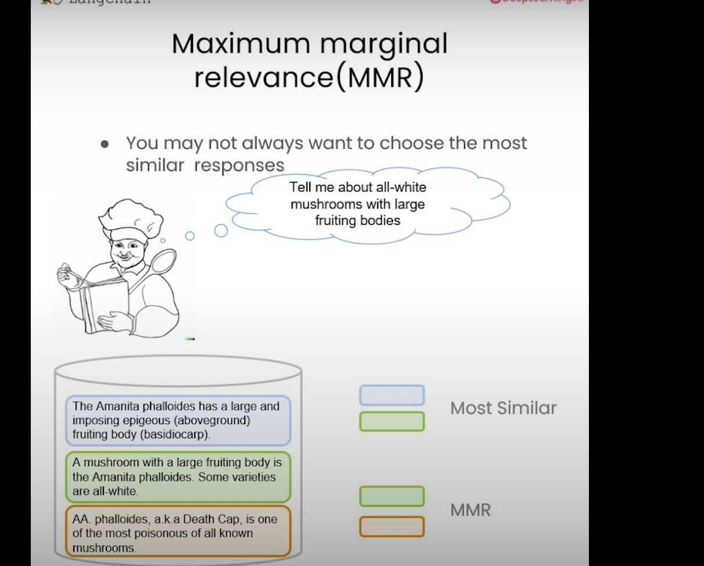

# Retreival
- Getting relevant information

- Semantic search (most similar) might give issue, in figure below, it gives information about mushroom, but it does not give information that it mightbe poisionious. So we could use `Maximum Marginal Relevance (MMR)`.


## Maximum Marginal Relevance (MMR)

- get kth most similar response
- And choose the `k` most diverse.
```python
from langchain.vectorstores import Chroma
from langchain.embeddings.openai import OpenAIEmbeddings
persist_directory = 'docs/chroma/'

embedding = OpenAIEmbeddings()
vectordb = Chroma(
    persist_directory=persist_directory,
    embedding_function=embedding
)

print(vectordb._collection.count())

texts = [
    """The Amanita phalloides has a large and imposing epigeous (aboveground) fruiting body (basidiocarp).""",
    """A mushroom with a large fruiting body is the Amanita phalloides. Some varieties are all-white.""",
    """A. phalloides, a.k.a Death Cap, is one of the most poisonous of all known mushrooms.""",
]

smalldb = Chroma.from_texts(texts, embedding=embedding)

question = "Tell me about all-white mushrooms with large fruiting bodies"

smalldb.similarity_search(question, k=2) # k=2 means 2 most similar documents
''' output 

    [Document(page_content='A mushroom with a large fruiting body is the Amanita phalloides. Some varieties are all-white.', metadata={}),
     Document(page_content='The Amanita phalloides has a large and imposing epigeous (aboveground) fruiting body (basidiocarp).', metadata={})]
''' 
# Gave back 2 most similar documents, but no mention of posinious factor


smalldb.max_marginal_relevance_search(question,k=2, fetch_k=3) # return 2 documents, but fetch 3 first and then based on relevance return 2
'''
<!--StartFragment-->

    [Document(page_content='A mushroom with a large fruiting body is the Amanita phalloides. Some varieties are all-white.', metadata={}),
     Document(page_content='A. phalloides, a.k.a Death Cap, is one of the most poisonous of all known mushrooms.', metadata={})]

<!--EndFragment-->

'''
# see it returned the third one instead of second one
```
## LLM Aided Rerieval

- Working with metadata.
```python
question = "what did they say about regression in the third lecture?"
docs = vectordb.similarity_search(
    question,
    k=3,
    filter={"source":"docs/cs229_lectures/MachineLearning-Lecture03.pdf"}  # only get response from these docs
)
for d in docs:
    print(d.metadata)

'''
<!--StartFragment-->

    {'source': 'docs/cs229_lectures/MachineLearning-Lecture03.pdf', 'page': 0}
    {'source': 'docs/cs229_lectures/MachineLearning-Lecture03.pdf', 'page': 14}
    {'source': 'docs/cs229_lectures/MachineLearning-Lecture03.pdf', 'page': 4}

<!--EndFragment-->

'''
```

## Compression

```python
from langchain.retrievers import ContextualCompressionRetriever
from langchain.retrievers.document_compressors import LLMChainExtractor

def pretty_print_docs(docs):
    print(f"\n{'-' * 100}\n".join([f"Document {i+1}:\n\n" + d.page_content for i, d in enumerate(docs)]))

# Wrap our vectorstore
llm = OpenAI(temperature=0, model="gpt-3.5-turbo-instruct")
compressor = LLMChainExtractor.from_llm(llm)

compression_retriever = ContextualCompressionRetriever(
    base_compressor=compressor,
    base_retriever=vectordb.as_retriever()
)
question = "what did they say about matlab?"
compressed_docs = compression_retriever.get_relevant_documents(question)
pretty_print_docs(compressed_docs)

compression_retriever = ContextualCompressionRetriever(
    base_compressor=compressor,
    base_retriever=vectordb.as_retriever(search_type = "mmr")
)

question = "what did they say about matlab?"
compressed_docs = compression_retriever.get_relevant_documents(question)
pretty_print_docs(compressed_docs)
```