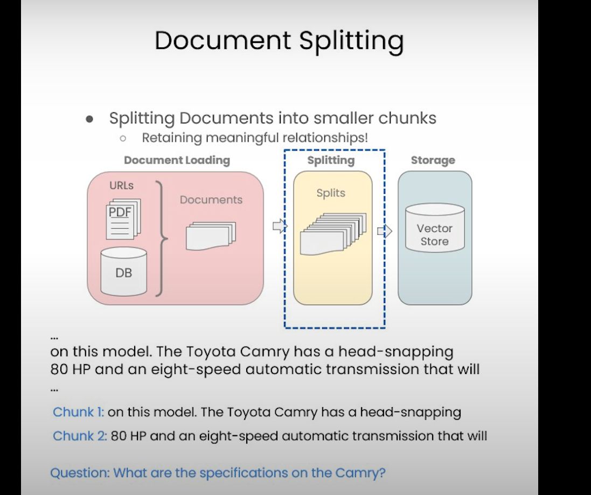
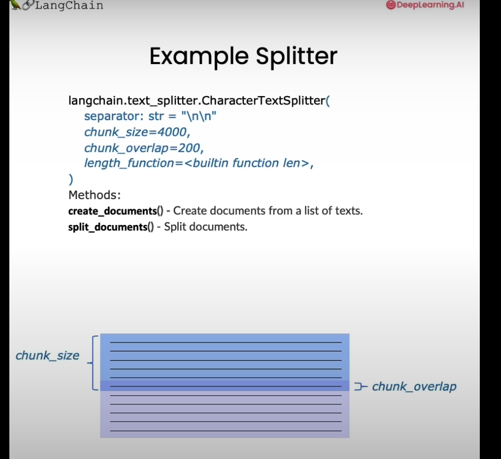
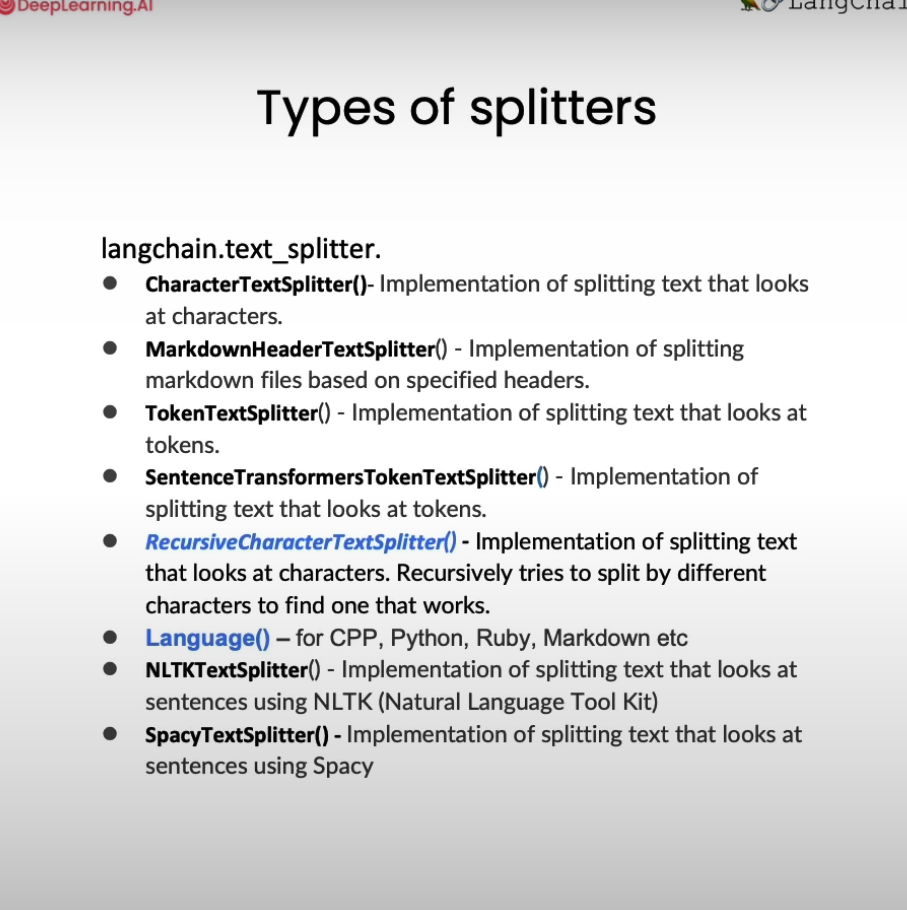

# Document Splitting

## Intro
- Splitting documents into smaller chunks.
- Need to be careful, as seen in screenshot below, one single sentences might be split into multiple chunks, so context is ignored.

- `chunk_size` gives the size of each chunk we want, and `chunk_overlap` gives like a sliding windows, where 2 chunks could have same context.

## Types of Splitting


```python
import os
import openai
import sys
sys.path.append('../..')

from dotenv import load_dotenv, find_dotenv
_ = load_dotenv(find_dotenv()) # read local .env file

openai.api_key  = os.environ['OPENAI_API_KEY']
```


```python
from langchain.text_splitter import RecursiveCharacterTextSplitter, CharacterTextSplitter
chunk_size =26
chunk_overlap = 4

r_splitter = RecursiveCharacterTextSplitter(
    chunk_size=chunk_size,
    chunk_overlap=chunk_overlap
)
c_splitter = CharacterTextSplitter(
    chunk_size=chunk_size,
    chunk_overlap=chunk_overlap
)

text1 = 'abcdefghijklmnopqrstuvwxyz'
r_splitter.split_text(text1)
# output: ['abcdefghijklmnopqrstuvwxyz'] because the recursive one has chunk size of 26

text2 = 'abcdefghijklmnopqrstuvwxyzabcdefg'
r_splitter.split_text(text2)
# output:['abcdefghijklmnopqrstuvwxyz', 'wxyzabcdefg']

text3 = "a b c d e f g h i j k l m n o p q r s t u v w x y z"
r_splitter.split_text(text3)
#output: ['a b c d e f g h i j k l m', 'l m n o p q r s t u v w x', 'w x y z'] space is also treated as character

c_splitter.split_text(text3)
# output, no split because character splitter takes \n as default sperator character
c_splitter = CharacterTextSplitter(
    chunk_size=chunk_size,
    chunk_overlap=chunk_overlap,
    separator = ' '
)
c_splitter.split_text(text3)
```

## Recursive splitting details

`RecursiveCharacterTextSplitter` is recommended for generic text. 


```python
some_text = """When writing documents, writers will use document structure to group content. \
This can convey to the reader, which idea's are related. For example, closely related ideas \
are in sentances. Similar ideas are in paragraphs. Paragraphs form a document. \n\n  \
Paragraphs are often delimited with a carriage return or two carriage returns. \
Carriage returns are the "backslash n" you see embedded in this string. \
Sentences have a period at the end, but also, have a space.\
and words are separated by space."""

c_splitter = CharacterTextSplitter(
    chunk_size=450,
    chunk_overlap=0,
    separator = ' '
)
r_splitter = RecursiveCharacterTextSplitter(
    chunk_size=450,
    chunk_overlap=0, 
    separators=["\n\n", "\n", " ", ""] # first tried to split using double new lines, then tries new line, then space, then on periods?
)

c_splitter.split_text(some_text)

r_splitter.split_text(some_text)

r_splitter = RecursiveCharacterTextSplitter(
    chunk_size=150,
    chunk_overlap=0,
    separators=["\n\n", "\n", "\. ", " ", ""]
)
r_splitter.split_text(some_text)

r_splitter = RecursiveCharacterTextSplitter(
    chunk_size=150,
    chunk_overlap=0,
    separators=["\n\n", "\n", "(?<=\. )", " ", ""] # fixing regex issue or periods
)
r_splitter.split_text(some_text)

from langchain.document_loaders import PyPDFLoader
loader = PyPDFLoader("docs/cs229_lectures/MachineLearning-Lecture01.pdf")
pages = loader.load()
```

```python
from langchain.text_splitter import CharacterTextSplitter
text_splitter = CharacterTextSplitter(
    separator="\n",
    chunk_size=1000,
    chunk_overlap=150,
    length_function=len
)
```


```python
docs = text_splitter.split_documents(pages)
```


```python
len(docs)
```


```python
len(pages)
```


```python
from langchain.document_loaders import NotionDirectoryLoader
loader = NotionDirectoryLoader("docs/Notion_DB")
notion_db = loader.load()
```


```python
docs = text_splitter.split_documents(notion_db)
```


```python
len(notion_db)
```


```python
len(docs)
```

## Token splitting

We can also split on token count explicity, if we want.

This can be useful because LLMs often have context windows designated in tokens.

Tokens are often ~4 characters.


```python
from langchain.text_splitter import TokenTextSplitter
```


```python
text_splitter = TokenTextSplitter(chunk_size=1, chunk_overlap=0)
```


```python
text1 = "foo bar bazzyfoo"
```


```python
text_splitter.split_text(text1)
```


```python
text_splitter = TokenTextSplitter(chunk_size=10, chunk_overlap=0)
```


```python
docs = text_splitter.split_documents(pages)
```


```python
docs[0]
```


```python
pages[0].metadata
```

## Context aware splitting

Chunking aims to keep text with common context together.

A text splitting often uses sentences or other delimiters to keep related text together but many documents (such as Markdown) have structure (headers) that can be explicitly used in splitting.

We can use `MarkdownHeaderTextSplitter` to preserve header metadata in our chunks, as show below.

- markDownTextSplitter can split texts according to the different headers we pass in.

```python
from langchain.document_loaders import NotionDirectoryLoader
from langchain.text_splitter import MarkdownHeaderTextSplitter
```


```python
markdown_document = """# Title\n\n \
## Chapter 1\n\n \
Hi this is Jim\n\n Hi this is Joe\n\n \
### Section \n\n \
Hi this is Lance \n\n 
## Chapter 2\n\n \
Hi this is Molly"""
```


```python
headers_to_split_on = [
    ("#", "Header 1"),
    ("##", "Header 2"),
    ("###", "Header 3"),
]
```


```python
markdown_splitter = MarkdownHeaderTextSplitter(
    headers_to_split_on=headers_to_split_on
)
md_header_splits = markdown_splitter.split_text(markdown_document)
```


```python
md_header_splits[0]
```


```python
md_header_splits[1]
```

Try on a real Markdown file, like a Notion database.


```python
loader = NotionDirectoryLoader("docs/Notion_DB")
docs = loader.load()
txt = ' '.join([d.page_content for d in docs])
```


```python
headers_to_split_on = [
    ("#", "Header 1"),
    ("##", "Header 2"),
]
markdown_splitter = MarkdownHeaderTextSplitter(
    headers_to_split_on=headers_to_split_on
)
```


```python
md_header_splits = markdown_splitter.split_text(txt)
```


```python
md_header_splits[0]
```


```python

```
