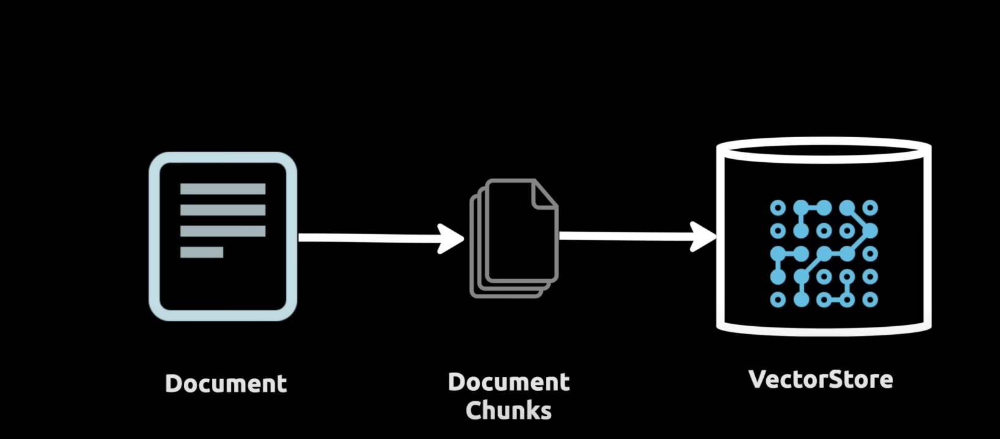
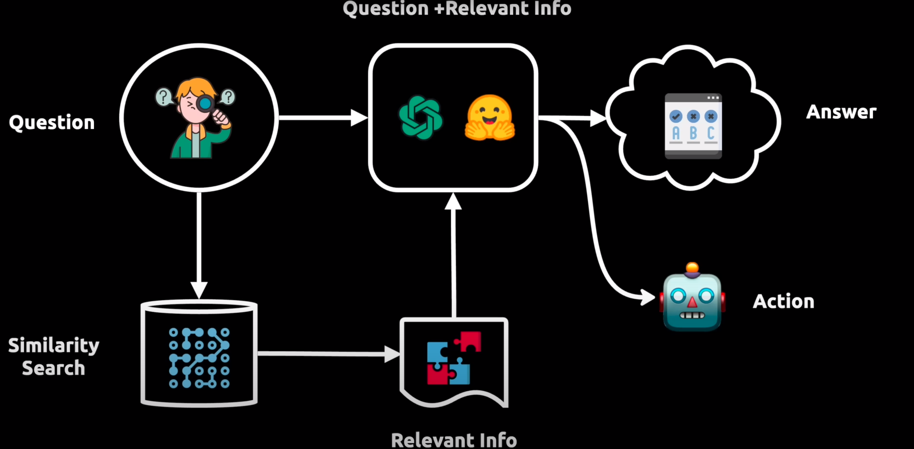
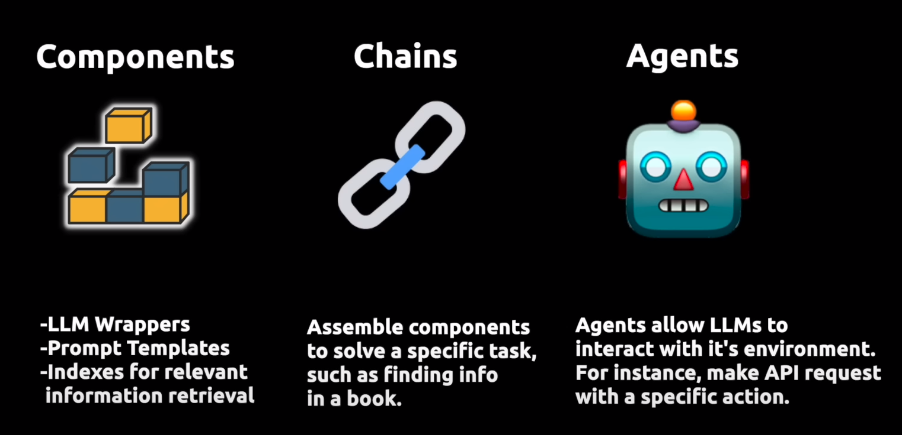

# Langchain
- Screenshot taken from [this youtube video](https://www.youtube.com/watch?v=aywZrzNaKjs). [Code](https://github.com/rabbitmetrics/langchain-13-min/blob/main/notebooks/langchain-13-min.ipynb) used in the video.
- We can reference external document when we query something

- The relevant search is stored in a vector database

- Core components
