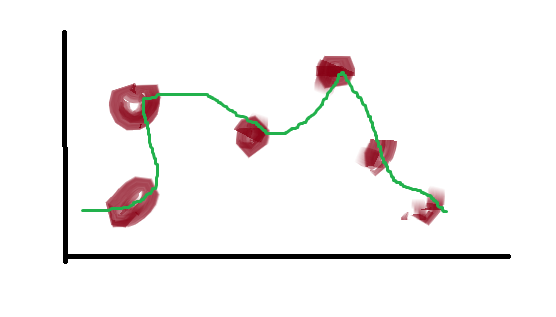
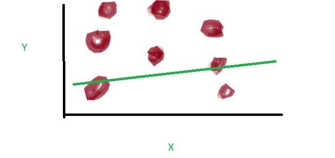

# Cross Validation
1. Overfitting
       - Model is fitted to well on training data set, performs very badly on test dataset. Model has become too complicated.
   - Learns noise instead of actual relationship between variables, and the noise is not present in training dataset.

2. Underfitting
   - model has not been fitted well on training dataset.
   - misses trends in training datasets.
   - happens usually when we use too simple models for the problems.

## K-folds cross validation
- helps avoid overfitting (more) and underfitting.
- Whole data set treated as test data set.
- Data divided into chunks default k = 5, by default in python its 3.
- | C1 | C2 | C3 | C4 | C5 |
- First trained on C1, and others treated as test dataset.
- Second trained on C2, rest test.
- and so on
- Finally, Trained on C5, rest test.
- Since there are many iteration, it takes a lot of time.
- Example from python
```python
from sklearn import datasets, linear_model
from sklearn.model_selection import cross_validate
from sklearn.metrics import make_scorer
from sklearn.metrics import confusion_matrix
from sklearn.svm import LinearSVC
diabetes = datasets.load_diabetes()
X = diabetes.data[:150]
y = diabetes.target[:150]
lasso = linear_model.Lasso()
cv_results = cross_validate(lasso, X, y, cv=3)
sorted(cv_results.keys())
cv_results['test_score']
```