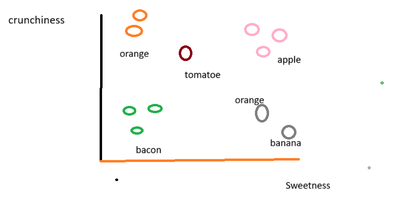
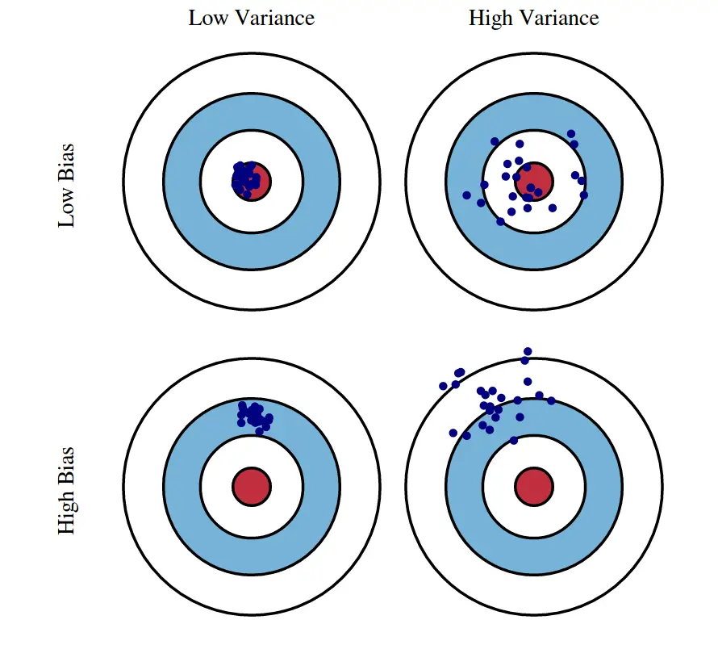

# K-Nearest Classifier
- Many classes, not just binary like logistic.
- classifies examples to the **most similar labelled examples**.
- Very simple yet powerful.
- Well suited for classification tasks where relationship between feataures are complicated and hard to understand.
- **kNN** algorithm identifies **k** elements in training dataset that are the nearest in similarity.
- K=1, consider the closest item as its classification.
- k=2, consider the 2 closest item, if 2 different classification, 50 % chance.
- and  so on ..

## Lazy Learner
- No model is created.
- Training is fast, because no training at all, there are no parameters that need to be optimized at all.
- Just putt all the training data.
- Prediction is slow, have to calculate distance (eucladian) between other data points.

## Euclidean-distance
- for two points (x1,y1) and (x2,y2)
- euclidean distance d(x,y) = `math.sqrt((x1-x2)**2 + (y1-y1)**2)` (shortest path), not recommented for higher dimensions., sqrt calculation can be slow. instead square euclidean distance where no need to calculate sqrt.
- manhattan distance d(x,y) = | x1 - x2 |+ | y1-y2 | (longer path), preferred, scales well with higher dimensions.

## Bias and Variance Tradeoffs
- Bias is the incorrect assumptions in model. `E[H(x)]-y`,predicted value - actual value, if high, bias high and model is bad.
- high bias over simplifies the model, misses relationship (underfitting.)
- Variance is error from the sensitivity to random fluctuations in training dataasets.
- high variance (overfitting) focuses too much on training data and does not generalize well on data it has not seen before. `E[(Hx)]-E[H(x)**2]`, model learns noise insteead of relationship.

- Determine K value, important.
- Small k values, outliers (noise) has high impact, overfitting, high variance and low bias.
- If too large, majority class are considered, underfitting, low variance high bias.
- Use cross validation to find optimial value for K.

## Normalization
- distance measure needs some similar value, else we will have wild varaible distance.
- SO mormalize.
- Min-Max normalization: all values fall into range of 0 and 1. `Xnew=(X-minx(x))/(max(X)-min(X))`.
- Z-score normalization: uses mean and standard deviation. `Xnew=(X- mean(x))/StandardDeviation(X)`. preferred for Principal Component Analysis.
