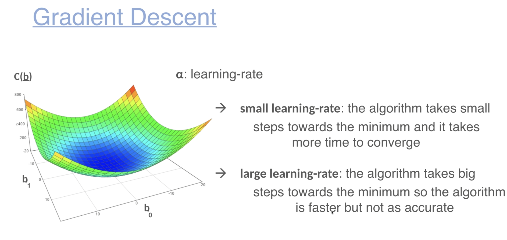

# Linear Regression
- Data grows linearly.

- we get the b values, with which we can predict other values

!

- for every data row, caculate with b0 and b1, basically get prediction and substract with actual value and get MSE squared.

- Get partial derivate of c(b), try to get low cost function of c(b)
- alpha symbol is the learning rate, the step we take to change b, if large, we take larger steps.
- Initially, random values of b are taken, and then adjusted.

- R squred error = (1-RSS)/TSS, higher is better. 0.4 shows no linear relation
- RSS residual sum of sqaures sum of all E(H(x)-y)**2
- TSS Total sum of squares E(y-Mean)**2