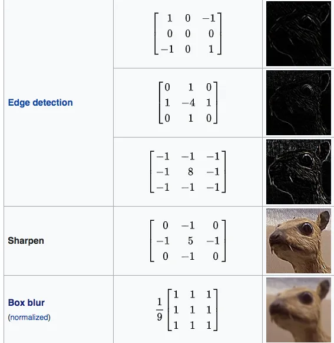
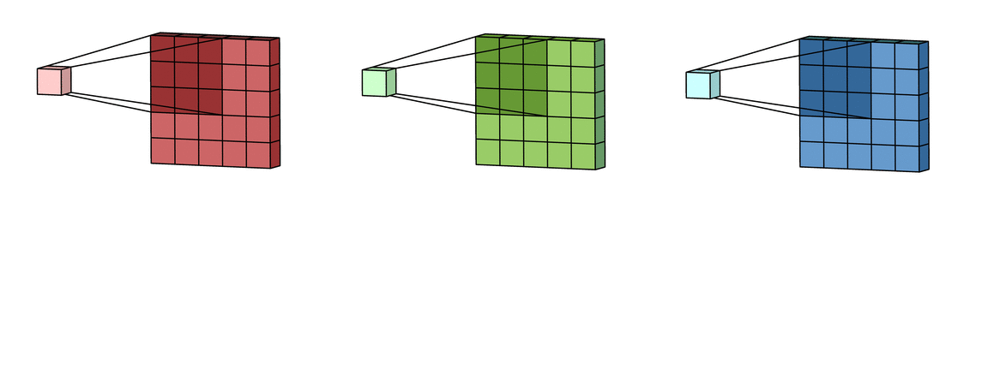
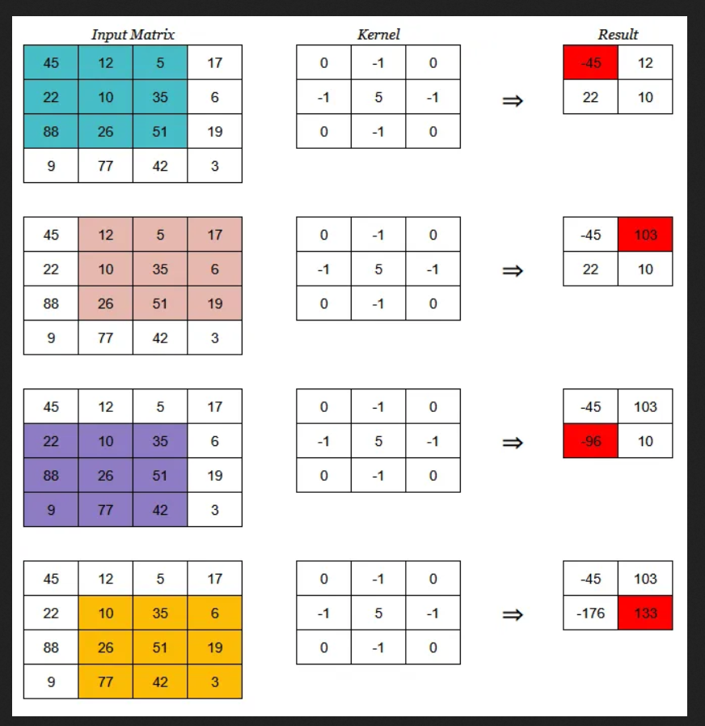

# Convolutional Neural Networks (CNN)
- Deep learning is cool, but as number of neurons increase, so does the number of weights.
- This creates a lot of connections, `combinatorial explosion`.
- Training becomes very slow.
- Soln -> `Convolutional Neural Networks`.
    - Nerons are not connected to every other neurons.
    - They have assumptions, Ex: inputs are images so we can encode certain properties into the architecture.
    - Under the hood, uses standard Neural network, but at beginning it transforms data in order to achieve best accuracy.
    - Takes the image as an input, subjects it to combinations of weights and biases, `extracts features` and outputs the results ([Medium](https://medium.com/analytics-vidhya/understanding-convolution-operations-in-cnn-1914045816d4))
    - Reduces feature dimension.
    - For example, for smile detection, we only need the smile portion, lets say the lips (the grin) in the face.
    - It finds the relevant features during training process.

## Steps in CNN
#### Convolutional operation
- `Image` is represented as a matrix, and `kernel`(feature detector) is another matrix.
- `convolution operation` is basically dot prodct of these two matrices.
- Different type of kernels
        - `sharpen kernel`makes image more sharp
- Use several kernels. we get several feature maps.

[ImageSource](https://medium.com/skylar-salernos-tech-blog/image-convolution-filters-explained-c878f1056e78)
    - `Blur kernel`. which is all 1s in a 3x3 matrix.
    - `Edge detection kernel`.
- Most of the points and images here are obtained from [this medium article](https://medium.com/analytics-vidhya/understanding-convolution-operations-in-cnn-1914045816d4). 
- From wikepiedia
<!--StartFragment-->

In mathematics convolution is a mathematical operation on two functions that produces a third function expressing how the shape of one is modified by the other

<!--EndFragment-->
- ITs for image.
<!--StartFragment-->

The shape of a kernel is heavily dependent on the input shape of the image and architecture of the entire network, mostly the size of kernels is **(MxM)** i.e a square matrix.

<!--EndFragment-->
- **Stride** defines by what step does to kernel move, for example stride of 1 makes kernel slide by one row/column at a time and stride of 2 moves kernel by 2 rows/columns.

- Convolition operation

<!--StartFragment-->

Sliding window protocol:

1.  The kernel gets into position at the top-left corner of the input matrix.
2.  Then it starts moving left to right, calculating the dot product and saving it to a new matrix until it has reached the last column.
3.  Next, kernel resets its position at first column but now it slides one row to the bottom. Thus following the fashion left-right and top-bottom.
4.  Steps 2 and 3 are repeated till the entire input has been processed.
5. After each dot product, its all summed up its put in a feature map
6. It seems each ith element is multplied with jth elementd and summed up ?
7. The end result is called `feature map`,the size of feature map is significantly smaller.

<!--EndFragment-->

#### Pooling
- `Spatial invariance`: make sure to detect the image, no matter where its located on screen and if its rotated.
- Ex: We do not care about the background image, only the picture of cat.
- We achieve this through pooling on he `feature map` we obtained from step 1.
- `Max Pooling`:
    - Consider the following feature map
    - ```
        1 0 1 2 0
        1 2 0 2 1
        1 0 0 1 0
        1 1 2 3 0
        0 0 1 0 0   
      ```
      - Now lets assume we are taking 2x2 pixels
      - First
      - ```
         1 0
         1 2  
        ```
      - The max value is `2`,
      - continue with
      - ```
         1 2
         0 2
        ```
        - Max vlaue is `2`, keep on going till end, we get
        - ```
           2 2 1
           1 3 0
           0 1 0 
          ```
- `Average Pooling` is also popular

#### Flattening
- Flaten the matrices, convert the result from poolin into a 1D array on row by row basis.
- ```
           2 2 1
           1 3 0
           0 1 0 
  ```
- converted to `[2 2 1 1 3 0 0 1 0]`.
- Now these values are considered features for the neural network.
- The 1D array will have the most relevant features.
- `softmax activation` to classify outputs.
- We use `gradient dscent` (backpropagation) as usual.

#### Math reference
https://www.math.univ-toulouse.fr/~besse/Wikistat/pdf/st-m-hdstat-rnn-deep-learning.pdf 