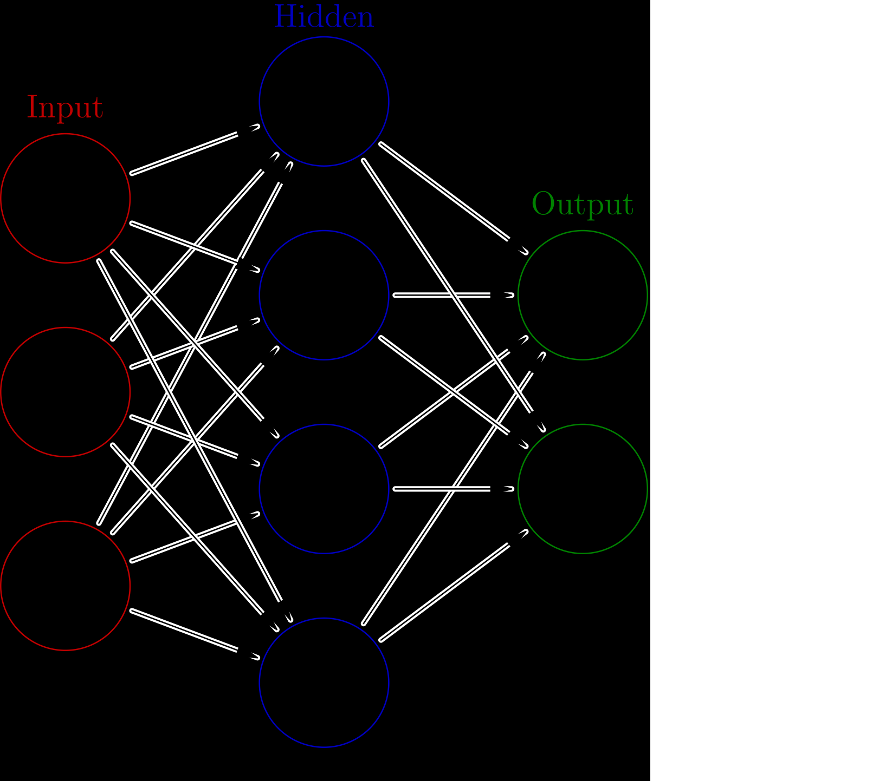
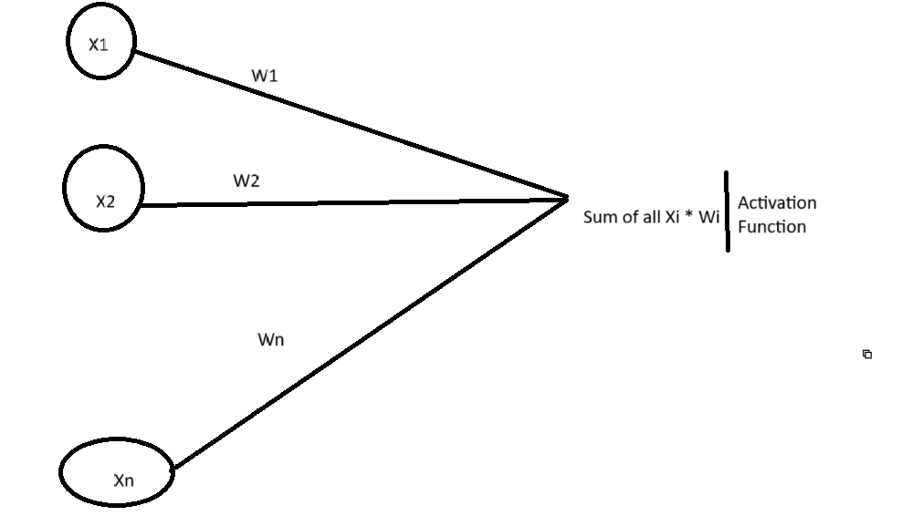
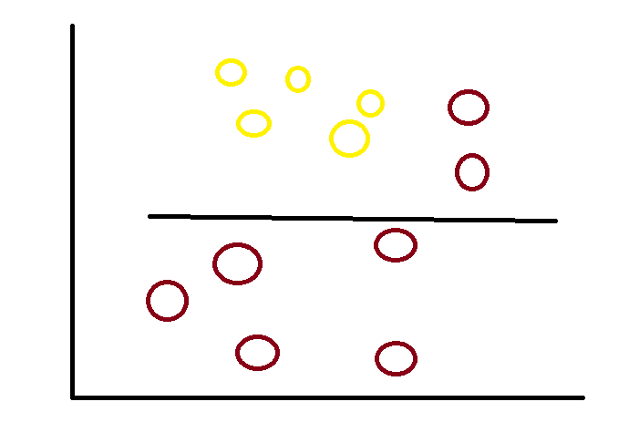
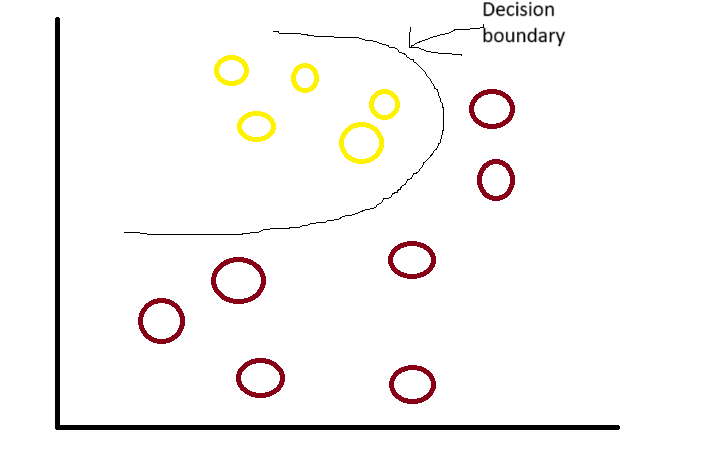
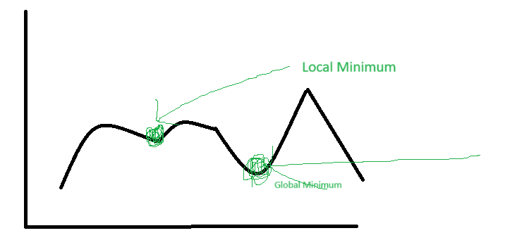

# Neural Network
- Useful for problems thats not solved by mathematical algorithm.
- Like Facial recogniziaation, Natural Language processing, easy for humans.
- So maybe mimic brain neural network?
- Insipired by human brain.
- `Neuron`, are unit that brain uses to process information.
- each neuron can contact with several thousand other neruons.
- `Axons` connect neurons (basically edges).
- Neurons only fire when given input is larger than a certain threshold.
- In figure `single layer feed forward network`, i.e. one hidden layer.

- `Input Layer`: Inputs to neural network are feeded thruoght input layer. Ex: RBGs numbers for image detection.
- `Hidden Layer`: Needed to make predicitons when we have non linearably seperable problems, more hidden layers capture more information. Thus deep neural nets came to be.
- `Output Layer`:We have result in this layer.

- Given Single layer. Neurons(Perceptions)
- `Weights`, can be amplify (W > 1) or deamplify (W < 1) the inputs. THis is how neural networks learn, change edge weights until neural network makes good predicitions.
- `Sum Functions`: From i=1 to i=n, Xi * Wi.
- `Activation Functions`:Takes output of sum function and converts it.
    - Ex: Step function, sigmoid function, ReLU function .
    - Introduces non linearility.
    - Sum functions just output linear combination, only helpful for linear relation.
- Without activaiton function, the graph

- With activation function

- `Activation Functions`
    - `1. Step function`: If input value is > 1, output is 1. If input value is < 0, output is 0. Just 0 and 1, no multi value outputs.
    - `2. Sigmoid function`: Output within range of 0 and 1. `y=(1/(1+e ** (-x)))`.
    - `3. Hyperbolic Tangent Function`:  Output within range of -1 to 1. Used to predict probabiliy.
        - `y=(e ** x - e ** -x)/(e ** x+ e ** -x)`.

## The Big Picture
- Feed forward neural network, every neuron is connected to next layer neurons. no backward transfer.
- Neural network keeps changing edge weight, so that we get optimal output.
- We keep on changing weight, with help of back propagation or gradient descent.

## Bias Node
- `Bias node` a `Bias units` An extra node in hidden layer, X (the parameter value) is always 1, weight needs to be adjusted. Idea is sometimes we need output value to be 1, even though all input value i 0.

## Error calculation
- Prediction - Actual.
- Calculated using Loss/Cost function, most popular Mean squared Error.
- L(W)=1/n * E|yi-yi prime| ** 2, where n is number of samples, y primes are predictions made.
- If L(W) is low, less errors so its good, if high high error which is bad.

## Optimization Problem
- Tuning w (weights), so that we find optimilat w such as L(w) is low.
- Gradient descent, stochastic gradient descent, meta-gradient approaches (genetic algorithms etc.)
- Huge number of weights, (as much as number of parameters), search space is huge (manny hidden layers in deep learning)
- dL(W)/d(w), direction of negative gradient.
- `Gradient calculation`: `∆w(subscript)t= α * + dL(W)/dw(subscript)t +μ + ∆w(subscript)t-1`
- ∆w(subscript)t = change in weight at time t
- α = learning rate (less means smaller steps, more accuracy but more time), usually 0.3.
- dL(W)/dw(subscript)t  = gradient (derivative of loss function)
- μ = momentum, escapes local minimum, does not always work. Defines how much we rely on previous weight update to current one, high can speed of convergence of system, but overshoot the minimum. too low: cannot avoid local optimums and slows down training.
- ∆w(subscript)t-1 = previous change in edge weight from previous iteration.

## Backpropagation
- not optimization algorithm.
- calculates the gradient of the error function with respect to neural network weights.
- Its a method for calculating the partial derivative. `dL(W)/dw`.
    - requires activaation function is differentiable (has a valid derivative. ex: sigmoid).
- Why called backpropagation, because errors at layer`n` is dependent on errors at the next `n+1` layer.
    - `dL(W)(superscript)k/dw=δ(subscript)k+1 * f(for n from 0 to  i, xi*wI)`.
    - δ(subscript)k+1, node delta at next layer.
        - f(for n from 0 to  i, xi*wI) activation of the neuron input.
- Oh lawd, soo many maths bro. https://en.wikipedia.org/wiki/Backpropagation .
- So send input, go hidden layer, then output in output layer, Now from output layer we update weights, and go back to hidden layer update weights and finally at input.

## Types Of Neural Network
1. For supervised learning (Train on known output):
   - `Artificial Neural Network (ANN)`: for regression and classfiication
   - `Convolutional Neural Netwrok (CNN)`: computer vision, self driving cars
   - `Recurrent neural networks (rnn)`: for time series analysis, stock price yesterday and today.
2. Unsupervised Learning: no dataset, algorithm itself is going to do classification
   - Boltzman-machines and autoencoders, self organizaing maps.

# Deep Learning
- Several hidden layers (10-5).
- Choosing activation function must be careful, sigmoid won't be a good possible solution.
    - `loss function`: measures how close a given neural network is to its ideal state. for regression MSE.
    - for classification negetive log likelihood. Maximum likelihood estimation. 

## Rectified Linear (ReLu) Activation function
- Activates a node only if the input is above certain threshold.
- f(x) = max(0,x)
- Gradient is either 0 or a constant, can solve vanishing gradient issue.
    - `Vanishing Gradient` : training function relies on activation function , each of neural network wegiths receives an update propotional to current weight in each iteration of training, sometimes gradient becomes vanishingly small, so may prevent weight from changing its value or may stop the neural network completely.
    - Formulae `repeat until convergence {wj = wj-α*(dL(w)/dwi)}`. α is learning rate, when `dL(w)/dwi` is small or close to zero, weight won't change.
- `Softmax function` is usally used for output layer. Generalization of logistic/sigmoid function. for multiclass classificaiton like handwritten digits classification. 10 digits, 10 possible outcomes, 10 neurons in output layer, probability in every single class.
- Gradient descent has one issue, it works fine for `convex loss` function i.e. only one minumum value, but not in cases where there might be local and global minimum loss function. Optimization get stuck in local minum. `Normalization` (min-max Normalization) helps here, faster conversion and more accuracy.
- `stohastic gradient descent` computes the gradient on every training sample, instead of the whole training sample. faster but less accurate, different minimum on consequetives run.

## Hyper parameters
1. `Learning rate`: Defines the pace of learning. α > 1 is to high, α < 0.01 is too low.
2. `Momentum`: Helps learning algorithm get out of spots in search space where otherwise it would get stuck.

- Value between 0 and  1, that increases the size of steps taken towards the minimum by trying to jump from a local minima.
- if this is large, keep learning rate smaller.
- If this is large, means convergence is large.
3. `Regularization`: Dropout, remove some neurons in hidden layer, with some probability. helps avoid overfitting.
