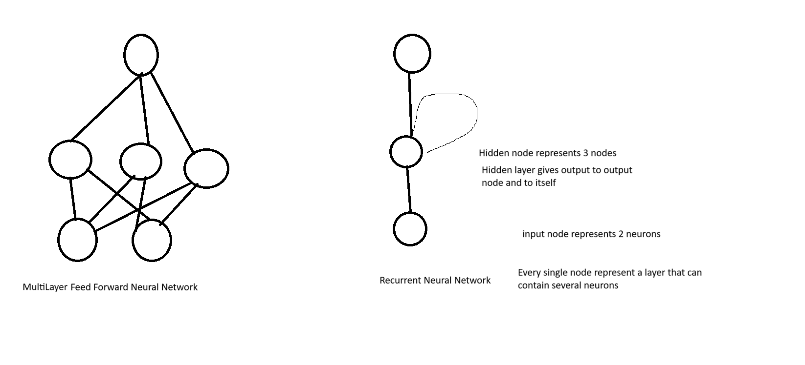
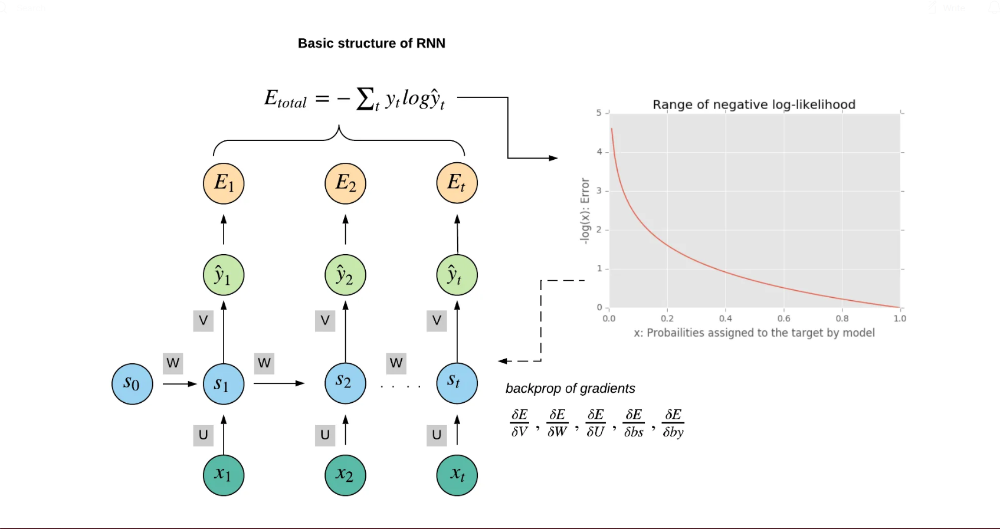

# Recurrent Neural Network (RNN)
Reference: https://www.theaidream.com/post/introduction-to-rnn-and-lstm
- Extremely important in Natural Language Processing.
- Google translate relies heavily on it.
- Can use RNN to make time series analysis, determine stock prices.
- `Turing Test`: a computer passes turing test if a human is unable to distinguish the computer from a human in a blind test.
- RNN can pass turing test, ex: a well trained RNN model can speak english.
- `LEARN LANGUAGE MODELS`.
- Can understand connection between data that are far away.
    - Ex: "I am from nepal, ..… jpt test ..… I can speak ". It is able to gues the last word `nepali`.
- In combination with CNN, we can also get a description from an image.

### The Basics
- In Feed Forward Neural Network, training samples are not related to each other. p(t) is not related to p(t-1) or p(t-2) …
- Ex: Tigers, elepants, cows have nothing to do wth each other.
- In RNN training samples are correlated with eac other, p(t) depends on p(t-1), p(t-2) …

- Every single neuron points back to itself as well

- several paramters are shared across layers.
- How to train RNN ? we unroll in time to end up with a feedforward network in that particular time.

Image pulled from [this article](https://medium.com/towards-datascience/recurrent-neural-networks-101-1c1eea9d1776).
- `Vanising gradiet problem/exploding gradient`: Backgrpopagation through time, gradients are passed from future time to current time, as weights are updated with value < 1, multiple times cause many layers, `very very deep`, it becomes tooo close to zero, `edge weight wont update furhter from its layers`, or tooo large, so the model stops learning.
- There are many local optima, but we want to global optima., meta heuristic algorithms.
- Soln for exploding gradient: truncated BPTT, small backpropagation through k time steps, adjust learning rate.
- Soln for vanihsing gradient problem: initialize weghts properly (xavier-inilization), use proper activation functions like RELU, use other architectures like LSTM or GRUs.

### Long-Short Term Memory Mode
- It has 3 gates, `Forget Gate`, `Input Gate` and `Output Gate`.
- Instead of h units, (in above figuvre its `s` units) we add some memory to the neural network and we want to manipulate them.
- Add relevant informatrion in memory.
- Ex: cat of ears, after some learning it might forget about it, but with memory cells we could get them back
<!--StartFragment-->

1.  LSTM is an enhanced version of regular RNN (Recurrent Neural Networks).
2.  It's designed to capture long-term dependencies in sequence data.
3.  Regular RNNs mainly focus on short-term memory due to the influence of nearby activations on hidden states.
4.  LSTM redesigns RNNs to have an activation state that can act as weights, preserving information over long distances.
5.  The term "Long Short-Term Memory" reflects the ability of LSTM to manage both short and long-term information in sequences.

<!--EndFragment-->
- Ok theres a bit too much complication here, so heres some text thats straight up from chat GPT
```
Long Short-Term Memory (LSTM) is a type of recurrent neural network (RNN) architecture designed to overcome the vanishing gradient problem and to capture long-term dependencies in sequence data.

Here's how LSTM works within the context of a recurrent neural network:

    Memory Cells: The key component of LSTM is its memory cell. Unlike traditional RNNs, which have a simple hidden state, LSTM cells have a more complex structure that includes a memory cell and various gates to control the flow of information.

    Gates: LSTM cells have three main gates:
        Forget Gate: This gate decides what information to discard from the cell state. It looks at the previous hidden state ht−1ht−1​ and the current input xtxt​, and outputs a value between 0 and 1 for each number in the cell state Ct−1Ct−1​. A value of 0 means "completely forget this information," while a value of 1 means "completely keep this information."
        Input Gate: This gate decides what new information to store in the cell state. It consists of two parts: a sigmoid layer that decides which values to update, and a tanh layer that creates a vector of new candidate values to add to the state.
        Output Gate: This gate decides what information to output based on the current input and the memory of the cell. It controls the information flow from the current cell state to the output.

    Updating the Cell State: The cell state CtCt​ is updated using the forget gate, input gate, and output gate:
        Forget Gate: ft=σ(Wf⋅[ht−1,xt]+bf)ft​=σ(Wf​⋅[ht−1​,xt​]+bf​)
        Input Gate: it=σ(Wi⋅[ht−1,xt]+bi)it​=σ(Wi​⋅[ht−1​,xt​]+bi​), C~t=tanh⁡(WC⋅[ht−1,xt]+bC)C~t​=tanh(WC​⋅[ht−1​,xt​]+bC​)
        Update Cell State: Ct=ft∗Ct−1+it∗C~tCt​=ft​∗Ct−1​+it​∗C~t​

    Updating the Hidden State: The hidden state htht​ is updated based on the updated cell state:
        Output Gate: ot=σ(Wo⋅[ht−1,xt]+bo)ot​=σ(Wo​⋅[ht−1​,xt​]+bo​)
        Update Hidden State: ht=ot∗tanh⁡(Ct)ht​=ot​∗tanh(Ct​)

In summary, LSTM networks are able to maintain long-term dependencies in sequences by selectively remembering or forgetting information over time using the forget gate, input gate, and output gate mechanisms. This enables them to effectively process and learn from sequential data.
```

- `Gated Recurrent Units`: a simplified version of LSTM, no memory cells, all gates in the single unit.