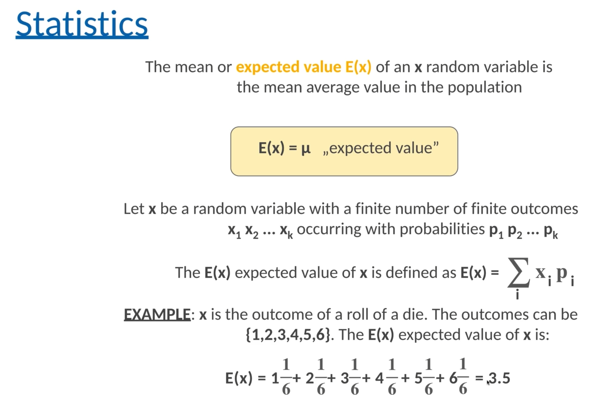
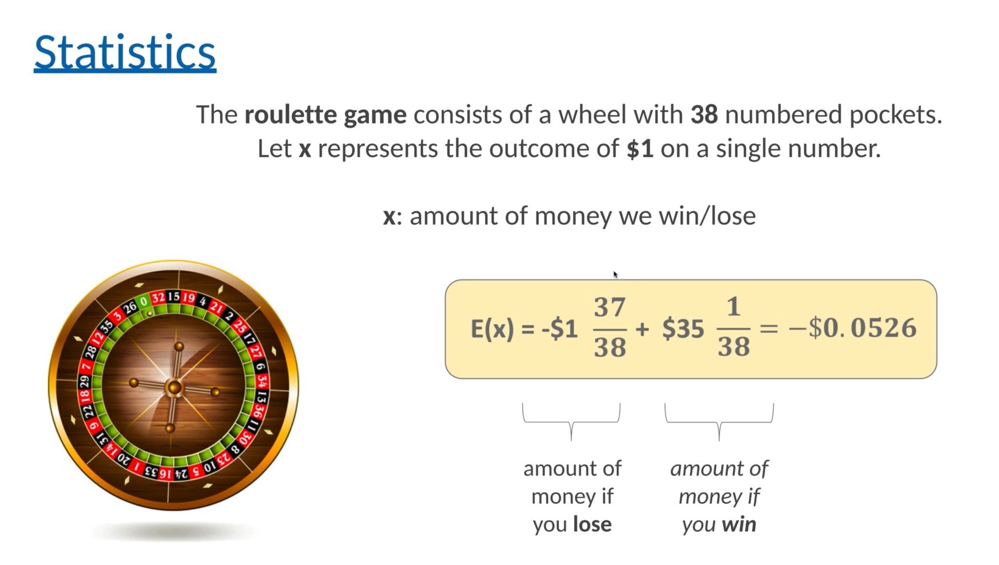
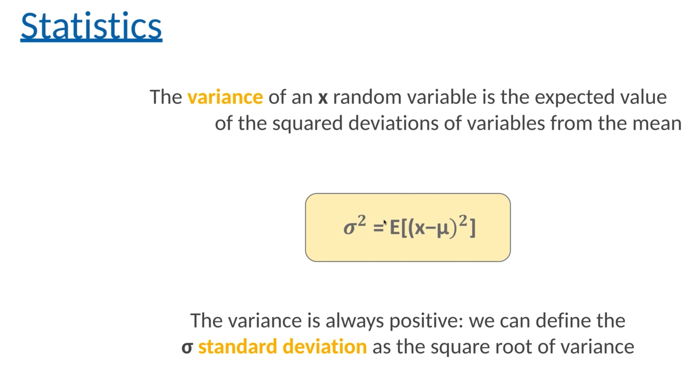
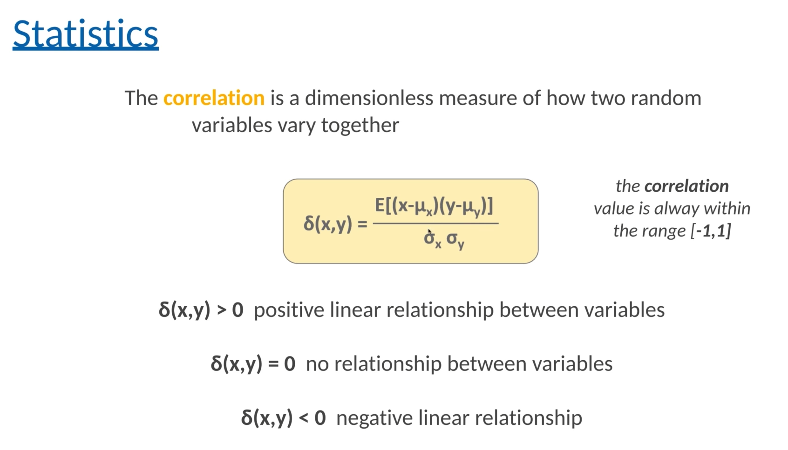

# AI
## Types
- supervised: provide labelled datasets.
- unsupervised: no labelled datasets, machine learning algorithm finds relationship, ex: clustering algorithms
- reinforcement learning: no datasets, interacts with environment to learn.

## Statistics

- 1/6 is probablity of each dice.

- standard variation is square root of variance.
- x here can be any value.

