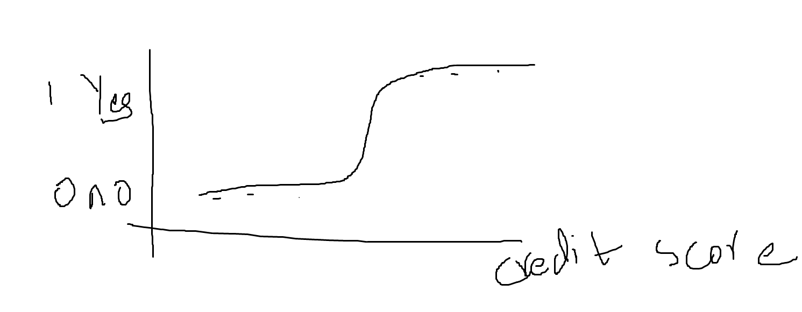

# Logistic Regression
- linear regression gives scalar value.
- Logistic regression used for binary classification. 0 or 1.
- It assigns probabilty to given outcome.
- It makes curve like this:

- Sigmoid function
- For single Parameter **_p(x)=1/(1+e ** -(b0 + b1 * x))_**
- For multiple Parameter **_p(x)=1/(1+e ** -(b0 + b1 * x1+ ..… bn * xn))_**
- Here b0 b1 are model parameters, can be found using gradient descent and maximum-likelihood method.
- Here used maximum-likelihood method.
